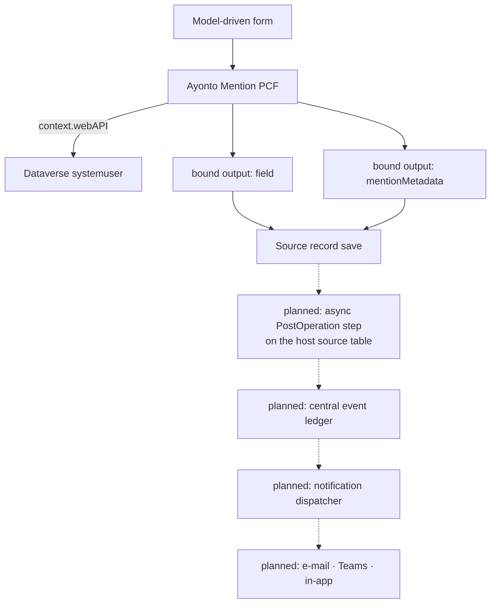

# Ayonto Mention

[](https://github.com/Ayonto-Digital-Solutions/ayonto-mention/actions/workflows/ci.yml)
[](LICENSE)
[](#current-status)

Ayonto Mention is a reusable `@mention` field control for Microsoft Power Apps and
Dataverse. It brings people-aware mentions to ordinary Dataverse text columns and
carries the identity of each mention out with the record, so that a server-side
step can turn it into a notification after the record is actually saved.

Version 1 targets **model-driven Power Apps**. The control is in active
development toward v1.0.0, and the notification backend is designed but not yet
implemented: **nothing is sent today.**

## What is Ayonto Mention?

Someone writes in a normal text field — a comment, a note, a description. They
type `@`, a few letters of a colleague's name, pick the right person from the
list, and keep writing. The text reads exactly as they typed it.

What makes that useful is what happens underneath: the control remembers **which
person** was picked, separately from the name on screen. Text cannot carry that.
Two colleagues called "Robin Fox" produce identical characters, and a name typed
out by hand looks the same as one chosen from the list.

Keeping identity apart from text is what gives the control these properties:

- **Namesakes stay distinct.** Two people with the same display name are two
  different mentions, told apart by their Dataverse user id.
- **A typed name is nobody.** Writing `@Alex Rivera` by hand does not make it a
  mention. Only picking a person does.
- **Mentions survive editing.** Typing in front of a mention, or anywhere else in
  the field, moves it without losing who it means.
- **Mentions survive saving.** A saved record carries the identities with it, so
  reopening it continues the same mentions rather than starting new ones.
- **One person, one episode.** While a colleague is mentioned at all, every
  occurrence of them shares one `eventId` — naming them twice is still one
  episode. Removing the last occurrence ends it; mentioning them again starts a
  new episode with a new `eventId`. Nothing is dispatched and no event record is
  created: the identifier travels with the record for a later server-side step.

## Current status

Most of what follows is about the **client**. The server side has one piece now:
the ingest that turns a saved record into event rows is implemented in code under
[`server/`](server/README.md), with unit tests. It has never run — the assembly is
not in the solution package, no step is registered anywhere, and no event row has
been created in any environment. Nothing reads or writes either table yet.

| Area | Status |
|---|---|
| Virtual React code component, Fluent UI v9 interface, English and German resources | ✅ implemented |
| `@` picker over Dataverse `systemuser`, debounced search, keyboard navigation, IME-safe commit | ✅ implemented |
| Mentions kept apart by user id, hand-typed names left as ordinary text | ✅ implemented |
| Mention re-anchoring across edits, whole-mention Backspace/Delete, character counter and `MaxLength` | ✅ implemented |
| Column security: unreadable columns masked, read-only columns not editable, unwritable companion column disables mentioning | ✅ implemented |
| Offline handling through `context.client`: typing continues, picker closes with a localized notice | ✅ implemented |
| Bound text output and bound companion-metadata output, reconciled as one host state | ✅ implemented |
| Saved mentions read back on reopen, with their occurrence positions and event identities | ✅ implemented |
| Read mode showing saved mentions as person tokens; one click or Enter/Space starts editing with the caret in the field | ✅ implemented |
| Identity confirmed against Dataverse before a saved mention becomes clickable; anything unconfirmed stays ordinary text | ✅ implemented |
| Clicking a confirmed token opens that `systemuser` through `context.navigation.openForm` | ✅ implemented |
| Automated tests and CI | ✅ implemented |
| Suggestion popup portalled and positioned against the field, through Fluent's positioning: opens below, flips above where there is no room, stays inside the viewport, follows the field when a form pane scrolls | ✅ implemented in code — the flipping, shifting, scrolling and resizing are a browser's arithmetic and are checked in a real environment, not in the test suite |
| Central `ayonto_mention` table packaged with the solution | ✅ from v1.1.0 — the table is installed by the import |
| Organization-owned `ayonto_mentionevent` event table, solution and package source | ✅ shipped as solution source in v1.1.0.1 — derived from the real legacy export, see [`powerplatform/README.md`](powerplatform/README.md) |
| That table accepted by a real Dataverse environment | ✅ `v1.1.0.2` managed was imported into the neutral development environment and accepted. v1.1.0.1 had been **rejected** there with `0x80044150`, *Requested value 'OrganizationOwned' was not found*, because solution XML serializes that ownership model as `OrgOwned`; the corrected serialization is what went through |
| `ayonto_EventId` alternate key, so one event identifier can only ever name one row | ✅ in the solution source and checked by the build — ⏳ newer than the import above, so not yet import-proven |
| Server-side ingest: a saved record becomes `ayonto_mentionevent` rows | ✅ implemented in code and unit-tested in [`server/`](server/README.md) — nothing has run it |
| That assembly packaged with the solution | ⏳ one committed registration file short, and verified to work once it is there — the pinned component identifiers it carries are a product decision, see [`server/README.md`](server/README.md) |
| The two ingest steps registered on a host table | ⏳ host-owned, and pending |
| Universal dispatcher, e-mail/Teams/in-app delivery | ⏳ not started, see [Roadmap](#roadmap) and [docs/server-architecture.md](docs/server-architecture.md) |

**Selecting a mention does not send anything today, and does not write a row to
`ayonto_mention` either.** The control writes the text and the mention metadata
as bound outputs. It writes nothing to Dataverse itself: its only Web API calls
are a `systemuser` search and a single-user read. From v1.1.0 the package
*installs* the table; what would fill it is the server-side ingest, whose code now
exists but is neither packaged nor registered anywhere.

## How it works



Solid arrows are implemented today. Everything marked *planned* is designed but
does not exist in this repository yet.

The control exposes the text and the companion metadata as bound outputs. The
server-side notification pipeline is designed to process those values only after
the source record has been committed.

**The ingest is built; nothing downstream of it is.** Which solution owns which
part of the server side, why the ingest is an asynchronous plug-in step registered
by the host solution rather than a flow, and what a server may and may not believe
about the companion column, are written down in
[`docs/server-architecture.md`](docs/server-architecture.md); the code and the
registration a host has to make are in [`server/README.md`](server/README.md).

**Where it is going** is written down in the same file, under
[Target architecture](docs/server-architecture.md#target-architecture): a
product-owned, organization-owned event table; one event row per recipient per
mention episode; one notification flow in its own central automation solution,
shared by every host application rather than copied into each; delivery state
kept per channel; and notification settings configured on the component itself.

The event table has shipped in the package since v1.1.0.1 and was **imported and
accepted** by a real environment as part of `v1.1.0.2` managed, once its ownership
serialization was corrected. From `1.1.0.3` it also carries the alternate key that
makes one event identifier name one row, and that key is newer than the import.

Of the rest of that list, the ingest is built and nothing downstream of it is.
How those component settings reach the server
authoritatively is now decided: the server resolves the published control
configuration from form metadata, per table and field, instead of trusting what a
client sent. One thing in it is still deliberately left open — what eventually
replaces the hand-configured companion column — and it is marked as such where it
appears, rather than described as if it were settled.

## Component configuration

The maker configures four properties, from
[`ControlManifest.Input.xml`](pcf/MentionControl/ControlManifest.Input.xml):

| Property | Usage | Required | Type | Purpose |
|---|---|---|---|---|
| `field` | bound | yes | `Multiple`, `SingleLine.Text`, `SingleLine.TextArea` | The ordinary Dataverse text column the editor reads and writes |
| `recordId` | input | yes | `SingleLine.Text` | The record the mentions belong to |
| `recordTable` | input | yes | `SingleLine.Text` | Logical name of the source table |
| `mentionMetadata` | bound | yes | `Multiple` | The hidden companion column carrying the mentions |
| `minRows` | input | no | `Whole.None` | Smallest height of the field, in rows of text. Default 3, clamped to 1–30 |

The record id and table are configured explicitly because the framework offers no
supported, generic way for a control to learn which record it sits on. The column
name is *not* asked for — it is read from the bound field's own metadata.

**Why the height is configured rather than detected.** The height a maker draws
in the form designer lives in the cell's rowspan, and a code component is not
told it: in a model-driven app `updateView` reports
[`allocatedHeight` as `-1`](https://learn.microsoft.com/en-us/power-apps/developer/component-framework/reference/mode/trackcontainerresize)
whether or not `trackContainerResize` is switched on. Measuring the box the host
put the control in would mean reaching outside the component, which is
[not supported](https://learn.microsoft.com/en-us/power-apps/developer/component-framework/code-components-best-practices#avoid-using-unsupported-framework-methods),
so this control does not do it. `minRows` is the supported answer: the maker says
it, and the textarea carries it. The textarea is also the field's only box — the
read view is drawn over it, with matching type and padding, rather than being a
second box of its own — so the field a user resized is never taken away and built
again. Vertical resizing stays enabled. It is optional with a default, so
forms configured before it existed keep working — a newer version of an imported
code component
[may add optional properties but not required ones](https://learn.microsoft.com/en-us/power-apps/developer/component-framework/faq#cannot-add-remove-properties-from-code-component-once-it-is-imported).
How this looks on a real form is checked in the DEV environment, not in the test
suite.

**One companion column per mention-enabled text column.** A Dataverse column holds
exactly one value, and each control instance writes its own. Two mention editors
sharing a companion column would silently overwrite each other's metadata, so each
mention-enabled text column gets its own, configured hidden.

## Companion metadata

The companion column carries `schemaVersion` 1:

```json
{
  "schemaVersion": 1,
  "sourceField": "description",
  "mentions": [
    {
      "eventId": "00000000-0000-4000-8000-000000000000",
      "recipientUserId": "00000000-0000-0000-0000-000000000000",
      "occurrences": [
        {
          "start": 6,
          "length": 12
        }
      ]
    }
  ]
}
```

| Field | Meaning |
|---|---|
| `schemaVersion` | The payload version. Anything else is not read. |
| `sourceField` | Logical name of the text column these mentions were written in. Server-side processing is designed to validate it against the mapping the host solution declared on its own plug-in step, rather than trust it. |
| `eventId` | Client-generated identity for one mention episode, carried so a later server-side step can be idempotent about it. It identifies; it authorizes nothing. |
| `recipientUserId` | The Dataverse `systemuser` id. Display names are deliberately never identity. |
| `occurrences` | Where that person stands in the text, as UI state — see below. |

`start` is a zero-based UTF-16 string index — the same index JavaScript strings
use — and points at the `@`. `length` covers the whole visible `@Display Name` and
stops there. `"Hello @Anna Berger today"` gives `start: 6, length: 12`.

**Occurrence positions are editor state, not authority.** They exist so a saved
record can be reopened and read as people rather than characters. They say nothing
about who may be notified, and a server-side step must never treat one as a reason
to notify anybody.

The payload deliberately does **not** contain the recipient's display name, their
email address, their job title or avatar, a copy of the text, the record id, the
table name, or any tenant or environment identifier.

Two reasons. The column sits on a business record and is writable by anyone who
may write the text column, by any means — so a name or address read from it would
be whatever the writer chose, not what Dataverse knows. And storing colleagues'
personal data in a hidden column on an unrelated record, for as long as that
record exists, is not something a mention needs in order to work.

## Mentions across sessions

A saved record carries `recipientUserId`, `eventId` and occurrence positions, so
reopening it does not start over. Reading them back is deliberately done in two
separate steps, because a position is not a person.

1. **Structural hydration.** The stored payload is treated as something a stranger
   wrote: version, column, identifier shapes, and every span are checked against
   the text actually in front of the control. A span must begin at an `@` that
   could have opened a mention and end where a mention may end, so a stored
   `@Alex Rivera` is not drawn over `@Alex RiveraX`. Anything structurally wrong
   ends the whole payload; a single span the text no longer supports is dropped
   and the rest kept. Nothing is repaired and nothing is written back.
2. **Identity confirmation.** Before a saved mention becomes a person you can
   click, the control reads that exact user through
   `context.webAPI.retrieveRecord("systemuser", id, "?$select=systemuserid,fullname")`
   and compares the result with the name standing in the text. Only a match
   becomes an interactive token.

Everything else — a name that no longer matches, a deleted user, a read the user
is not allowed to make, no connection at all — **falls back to ordinary text**.
Never to a possibly wrong clickable person.

This matters in ordinary cases, not just exotic ones. The same record can be saved
again by somebody else with the same sentence and a different Robin Fox behind the
name; the control follows the metadata, not the characters, and adopts text and
identities together so that no edit ever writes back a person who is no longer
meant.

Failing to confirm changes nothing about the record: no output, no save, no
rewrite of the payload. Opening a record with no connection leaves the metadata
exactly as it was, typing still carries the recorded identities along with the
text, and the confirmation simply happens once the control is given an online
context again.

## Privacy and security

- The control declares `external-service-usage` as disabled: no third-party calls.
- All Dataverse access stays inside the environment the control already runs in,
  over the documented `context.webAPI` surface, and is read-only: the control
  makes no create, update or delete call. It uses `retrieveMultipleRecords` for
  the user search and `retrieveRecord` to confirm a saved identity, and nothing
  else. Edits to `field` and `mentionMetadata` leave the control as bound
  outputs, which the host form persists with the record like any other value.
- No `Xrm`, no form context, no `contextInfo`, no host DOM traversal, no
  hand-built Dataverse URLs.
- Neither display names nor email addresses are persisted into `mentionMetadata`.
- Dataverse errors are never shown or logged: they can carry the environment URL
  and schema names with them.
- **`mentionMetadata` is client-supplied input.** Hiding a column on a form is not
  a security boundary: anyone who may write the text column may write the
  companion column too. That the control confirmed a user well enough to draw a
  token is a *display* decision made in one browser, and grants a future server
  nothing.
- Any server-side processor must therefore resolve and validate recipient identity
  itself before anything is delivered. The designed notification identity is
  `eventId` + `recordTable` + `recordId` + `sourceField` + `recipientUserId`;
  occurrence positions are not part of it.
- Delivery, when it exists, is intended as best-effort, and its state is kept per
  channel: one column cannot mean both "the mail arrived" and "the chat message
  did not". No exactly-once or guaranteed-delivery claim is made.

This repository is public and must stay customer-neutral — no tenant or
environment identifiers, no real addresses, no customer schema. See
[CONTRIBUTING.md](CONTRIBUTING.md); to report a vulnerability, see
[SECURITY.md](SECURITY.md).

## User lookup

The picker queries the Dataverse `systemuser` table through `context.webAPI`,
debounced while typing. It excludes:

- disabled users
- application users
- the **Support User** access mode
- the **Non-interactive** access mode

An organisation whose configuration refuses to filter on those columns is not left
without a lookup: the query is retried without them and the accounts are removed
from the result instead.

**The server enforces the same eligibility, and does not take the client's word for
it.** The ingest resolves the claimed recipient against `systemuser` itself — in the
context of the user whose save produced the claim, because that resolution is an
authorization — and refuses a disabled user, an application user and those two access
modes. Whether a mailbox exists is a delivery question and belongs to the dispatcher,
which is not implemented; Teams and in-app notification need no mailbox at all.

## Installation

Each release publishes two Dataverse solution packages:

| File | Type | Use it for |
|---|---|---|
| `AyontoMention_<version>_managed.zip` | managed | any environment that is not where this control is developed — test, UAT, production |
| `AyontoMention_<version>.zip` | unmanaged | a development environment, or to look inside the package |

Both contain the same two components, published as `Ayonto` with the prefix
`ayonto`, in the solution `AyontoMention`:

- the code component `Ayonto.AyontoMentionControl`
- the central `ayonto_mention` table, with its view and the ownership
  relationships a user-owned table carries

Import the package, then add the control to a text column on a model-driven form
and configure its properties as described above.

**The table is reused, not redesigned.** It is the table the productive legacy
solution exports, carried over unchanged — same logical name, **UserOwned**, same
sixteen columns, same view. This release repackages it under the `AyontoMention`
solution; it does not alter it.

**Its ownership is chosen, not inherited by accident.** A Dataverse table's
ownership is fixed when the table is created and
[cannot be changed afterwards](https://learn.microsoft.com/en-us/power-apps/maker/data-platform/types-of-entities),
so importing this package into an environment that does not yet have the table
settles the question there for good. Taking over the existing component means
taking over its ownership, and that is the trade this release makes deliberately
rather than recreating a table an installed application already depends on.
Ownership scopes row-level access; privileges still come from Dataverse security
roles. **v1.1.0 ships no security role and does not change the privileges an
environment already has configured.** Restricting direct writes to the table is
part of the server-side migration and cutover, not of this packaging release.

An environment still running the older mention control may need direct access to
this table for *that* implementation to keep working — it writes rows from the
browser. That is migration compatibility, not the new architecture, and this
release deliberately leaves it alone.

**It installs beside an older Ayonto mention control rather than over it.** The
earlier product occupies `Ayonto.MentionControl`; this one has a name of its own
because it requires configuration that the older contract has no place for, and a
code component cannot gain required properties in a later version. Both can be
present in one environment, and a form can carry either.

**What v1.1.0 contains.** The client, and the table:

- the mention field itself — picker, keyboard, IME-safe editing, atomic
  mention deletion, character counter
- saved mention identity, confirmed against Dataverse, and the read view that
  shows confirmed mentions as people
- suggestion popup positioned against the viewport
- `minRows` field-height fallback
- English and German resources
- offline, masking, read-only and column-security behaviour

- the central `ayonto_mention` table, its view and its relationships

**What it does not contain**: the ingest assembly — implemented under
[`server/`](server/README.md), and one committed registration file short of being
packaged — the registered steps, the dispatcher, e-mail, Teams and in-app delivery, and
any delivery configuration or state.
**Installing this release does not send notifications, and writes no rows into the
tables it installs.** The control records who was mentioned; turning that into a row,
and that row into a message, is the server-side work still ahead.

**What publishing v1.1.0 does and does not say.** The packages are built,
checked and downloadable. It is not a statement that any environment has been
validated — and for this release that matters more than it did before, because
the package now writes schema into the environment that imports it. In
particular, **an environment that already carries the legacy `AyontoPcfControls`
solution shares the `ayonto_mention` table with it, and how two managed
solutions behave over one table has not been tested here.** The automated suite cannot
prove how a field behaves in a browser on a form — jsdom performs no layout — so
before calling a particular deployment validated or production-ready, install the
package in a real model-driven app and work through the behaviour there: field
height and resizing, the read and edit views, the suggestion popup against the
viewport, tokens and navigation, keyboard paths, masking, read-only and offline.

## Requirements

- Microsoft Dataverse
- **Model-driven Power Apps.** Canvas apps are not a v1 target: `context.webAPI`
  is documented as available for model-driven apps and portals only, and
  `context.client.isOffline` / `isNetworkAvailable` and
  `context.navigation.openForm` are documented for model-driven apps.
- Platform libraries: the manifest declares React `16.14.0` and Fluent
  `@fluentui/react-components` `9.46.2`, and the npm dependencies are pinned to
  exactly those versions, so the control is written against the API surface it
  declares. Power Apps may load a higher compatible runtime version of a platform
  library.
- Node.js ≥ 24 for development

## Development

Everything lives in [`pcf/`](pcf); the repository root forwards the usual commands
there, so these work from the root of the clone:

```bash
npm ci --prefix pcf     # install exactly what package-lock.json pins
npm run build
npm run lint
npm run typecheck
npm test
```

Also available:

```bash
npm run test:coverage
npm run start           # PCF test harness
```

Running them from inside `pcf/` works too — there, use plain `npm ci`.

## Repository structure

```
.
├── pcf/
│   ├── MentionControl/     # PCF manifest, resources and framework adapter
│   ├── src/                # domain logic, components, hooks, services
│   └── tests/              # Jest suites
├── powerplatform/          # Dataverse solution project and source
│   ├── AyontoMentionSolution.cdsproj
│   └── src/                # classic SolutionPackager XML: Entities/, Other/
├── server/                 # the Dataverse plug-in ingest, net48, and its tests
│   ├── Ayonto.Mention.Ingest/
│   └── Ayonto.Mention.Ingest.Tests/
├── docs/
│   └── server-architecture.md   # the server side, who owns it, and what is proven
├── CONTRIBUTING.md
├── SECURITY.md
└── README.md
```

`pcf/src/` holds platform-neutral domain logic — text anchoring, episode tracking,
the metadata format, hydration — with the framework adapter kept separate, which is
why most of it is directly unit testable.

`powerplatform/` holds the Dataverse solution project and its source. **Power
Platform solution source must not be hand-authored** — the table there is the
one the legacy solution exports, copied in unchanged. See
[powerplatform/README.md](powerplatform/README.md).

## Design principles

- Documented platform APIs, never host internals or undocumented behaviour.
- Model-driven first; canvas support is a separate undertaking, not an assumption.
- The smallest client payload that can work.
- Identity is a Dataverse user id, never a display name.
- When identity cannot be proven, fail closed to ordinary text.
- The server trusts nothing the client sends.
- Domain logic is pure, deterministic and directly testable.
- The public source stays customer-neutral.
- No hand-authored solution or flow schema.

## Roadmap

1. PCF editor, companion metadata, persisted mention identity and viewport-aware
   suggestion positioning — **implemented**
2. Neutral Ayonto Dataverse development environment — also where the suggestion
   popup's flip, shift, scroll and resize behaviour gets verified against a real
   browser
3. Generate the solution and schema with supported Microsoft tooling
4. Central table packaged with the solution — **done in v1.1.0**, reusing the
   table the legacy solution exports rather than designing a new one. Superseded
   as the product ledger by the product-owned `ayonto_mentionevent` table in
   [Target architecture](docs/server-architecture.md#target-architecture)
5. Host-side ingest — asynchronous PostOperation plug-in steps that the host
   solution registers on its own source tables, against the plug-in type this
   solution supplies. The handler is **implemented and unit-tested** in
   [`server/`](server/README.md); packaging the assembly and registering the steps
   are both still ahead. See [`docs/server-architecture.md`](docs/server-architecture.md)
6. Generic notification dispatcher for e-mail, Teams and in-app delivery
7. Delivery channels and their configuration
8. Integration, concurrency and solution-import testing
9. Package and publish v1.0.0

No release date is promised.

## Contributing

See [CONTRIBUTING.md](CONTRIBUTING.md). The customer-neutrality rules apply to
every contribution, including issues and screenshots.

## License

MIT
