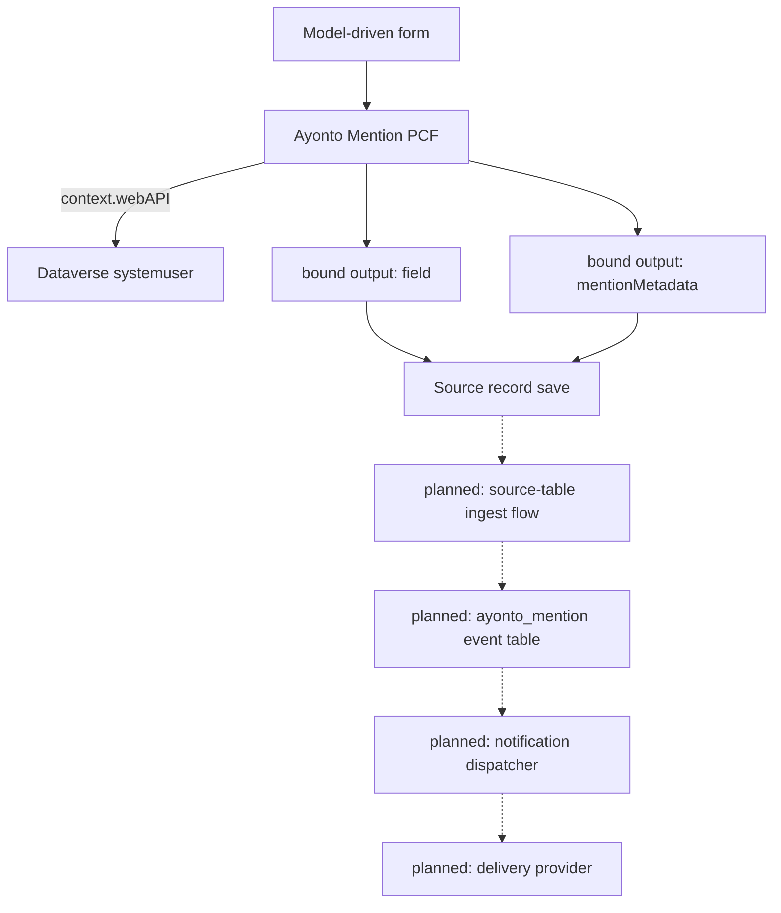

# Ayonto Mention

[](https://github.com/Ayonto-Digital-Solutions/ayonto-mention/actions/workflows/ci.yml)
[](LICENSE)
[](#current-status)

Ayonto Mention is a reusable `@mention` field control for Microsoft Power Apps and
Dataverse. It brings people-aware mentions to ordinary Dataverse text columns and
carries the identity of each mention out with the record, so that a server-side
step can turn it into a notification after the record is actually saved.

Version 1 targets **model-driven Power Apps**. The control is in active
development toward v1.0.0 and the notification backend is designed but not yet
implemented.

## Status

🚧 Initial development — v1.0.0

## What is Ayonto Mention?

Someone writes in a normal text field — a comment, a note, a description. They
type `@`, a few letters of a colleague's name, pick the right person from the
list, and keep writing. The text reads exactly as they typed it.

What makes that useful is what happens underneath: the control remembers **which
person** was picked, separately from the name on screen. Text cannot carry that.
Two colleagues called "Robin Fox" produce identical characters, and a name typed
out by hand looks the same as one chosen from the list.

Keeping identity apart from text is what gives the control these properties:

- **Namesakes stay distinct.** Two people with the same display name are two
  different mentions, told apart by their Dataverse user id.
- **A typed name is nobody.** Writing `@Alex Rivera` by hand does not make it a
  mention. Only picking a person does.
- **Mentions survive editing.** Typing in front of a mention, or anywhere else in
  the field, moves it without losing who it means — for the current editing
  session.
- **One person, one event.** Mentioning the same colleague twice in one text
  produces a single notification event for as long as they stay mentioned.
  Removing the last occurrence ends it; mentioning them again starts a new one.

Identity lives in the editing session. Version 1 deliberately does **not** try to
reconstruct who an existing `@name` in saved text meant — stored rows cannot prove
that, and guessing would notify the wrong person.

## Current status

| | Client (PCF) | Server |
|---|---|---|
| ✅ Implemented | Virtual React PCF control with a Fluent UI v9 interface · Dataverse `systemuser` lookup through `context.webAPI` · `@` suggestion picker with debounced search · keyboard navigation and IME-safe commit · duplicate display names kept apart by user id · mention reanchoring across text edits · bound text output · bound companion metadata output · notification-event identity per mention episode · record-boundary isolation · unsaved records · column-level security and read-only handling · automated tests and CI | — |
| ⏳ Planned for v1 | — | Generated `AyontoMention` solution source · `ayonto_mention` event table · alternate-key idempotency · table-specific ingest flow · generic notification dispatcher · delivery provider integration · managed and unmanaged release artefacts |

**Selecting a mention does not send anything today.** The control writes the text
and the mention metadata as bound outputs; nothing is dispatched, and no
`ayonto_mention` rows exist yet.

## How it works



Solid arrows are implemented today. Everything marked *planned* is designed but
does not exist in this repository yet.

The control exposes the text and the companion metadata as bound outputs. The
server-side notification pipeline is designed to process those values only after
the source record has been committed.

## Component configuration

The maker configures four properties, from
[`ControlManifest.Input.xml`](pcf/MentionControl/ControlManifest.Input.xml):

| Property | Usage | Required | Type | Purpose |
|---|---|---|---|---|
| `field` | bound | yes | `Multiple`, `SingleLine.Text`, `SingleLine.TextArea` | The ordinary Dataverse text column the editor reads and writes |
| `recordId` | input | yes | `SingleLine.Text` | The record the mentions belong to |
| `recordTable` | input | yes | `SingleLine.Text` | Logical name of the source table |
| `mentionMetadata` | bound | yes | `Multiple` | The hidden companion column carrying this session's mentions |

The record id and table are configured explicitly because the framework offers no
supported, generic way for a control to learn which record it sits on. The column
name is *not* asked for — it is read from the bound field's own metadata.

**One companion column per mention-enabled text column.** A Dataverse column holds
exactly one value, and each control instance writes its own. Two mention editors
sharing a companion column would silently overwrite each other's metadata, so each
mention-enabled text column gets its own, configured hidden.

## Companion metadata

The companion column carries `schemaVersion` 1:

```json
{
  "schemaVersion": 1,
  "sourceField": "description",
  "mentions": [
    {
      "eventId": "00000000-0000-4000-8000-000000000000",
      "recipientUserId": "00000000-0000-0000-0000-000000000000"
    }
  ]
}
```

| Field | Meaning |
|---|---|
| `eventId` | Client-generated identity for one notification event, used for later idempotency. It identifies; it grants nothing. |
| `recipientUserId` | The Dataverse `systemuser` id. Display names are deliberately never identity. |
| `sourceField` | Logical name of the text column these mentions were written in. Server-side processing is designed to validate it against configured mappings rather than trust it. |

The payload deliberately does **not** contain the recipient's name, their email
address, a copy of the text, occurrence positions, the record id, the table name,
or any tenant or environment identifier.

Two reasons. The column sits on a business record and is writable by anyone who
may write the text column, by any means — so a name or address read from it would
be whatever the writer chose, not what Dataverse knows. And storing colleagues'
personal data in a hidden column on an unrelated record, for as long as that
record exists, is not something a mention needs in order to work. Recipients are
meant to be resolved server-side, where they can be trusted.

## User lookup

The picker queries the Dataverse `systemuser` table through `context.webAPI`,
inside the environment the control already runs in. It excludes:

- disabled users
- application users
- the **Support User** access mode
- the **Non-interactive** access mode

The control makes no call to any service outside Dataverse. Server-side mailbox
validation is part of the designed notification pipeline and is not implemented
yet.

## Privacy and security

- The control declares `external-service-usage` as disabled: no third-party calls.
- User lookup stays inside the Dataverse environment, over the documented
  `context.webAPI` surface. No `Xrm`, no form context, no host DOM traversal.
- Neither names nor email addresses are persisted into `mentionMetadata`.
- Any future server-side processor must treat the companion metadata as
  **client-supplied input**. Hiding a column on a form is not a security boundary:
  anyone who may write the text column may write the companion column too.
- Recipient identity must therefore be resolved and validated server-side before
  anything is delivered.

This repository is public and must stay customer-neutral — no tenant or
environment identifiers, no real addresses, no customer schema. See
[CONTRIBUTING.md](CONTRIBUTING.md); to report a vulnerability, see
[SECURITY.md](SECURITY.md).

## Requirements

- Microsoft Dataverse
- Model-driven Power Apps — canvas apps are not a v1 target, because
  `context.webAPI` is documented as unavailable there
- Node.js ≥ 24 for development

## Development

```bash
npm ci --prefix pcf
npm run build
npm run lint
npm run typecheck
npm test
```

Also available:

```bash
npm run test:coverage
npm run start          # PCF test harness
```

## Repository structure

```
.
├── pcf/
│   ├── MentionControl/     # PCF manifest and framework adapter
│   ├── src/                # domain logic, components, hooks, services
│   └── tests/              # Jest suites
├── powerplatform/
│   └── src/                # reserved Dataverse solution source
├── CONTRIBUTING.md
└── README.md
```

`pcf/` holds the control, its platform-neutral domain logic and its tests.

`powerplatform/src/` is reserved for the generated Dataverse solution source and
currently contains placeholders only. **Power Platform YAML must not be
hand-authored** — every artefact is produced by supported PAC CLI or Dataverse
tooling and then committed. See [powerplatform/README.md](powerplatform/README.md).

## Design principles

- Documented platform APIs, never host internals or undocumented behaviour.
- Model-driven first; canvas support is a separate undertaking, not an assumption.
- The smallest client payload that can work.
- Identity is a Dataverse user id, never a display name.
- The server trusts nothing the client sends.
- Domain logic is pure, deterministic and directly testable.
- The public source stays customer-neutral.
- No hand-authored solution or flow schema.

## Roadmap

1. PCF editor and companion metadata — **implemented**
2. Neutral Ayonto Dataverse development environment
3. Generate the solution and schema with supported Microsoft tooling
4. `ayonto_mention` event ledger with its alternate key
5. Table-specific ingest flow
6. Generic notification dispatcher
7. Integration, concurrency and solution-import testing
8. Package and publish v1.0.0

No release date is promised.

## Contributing

See [CONTRIBUTING.md](CONTRIBUTING.md). The customer-neutrality rules apply to
every contribution, including issues and screenshots.

## License

MIT
