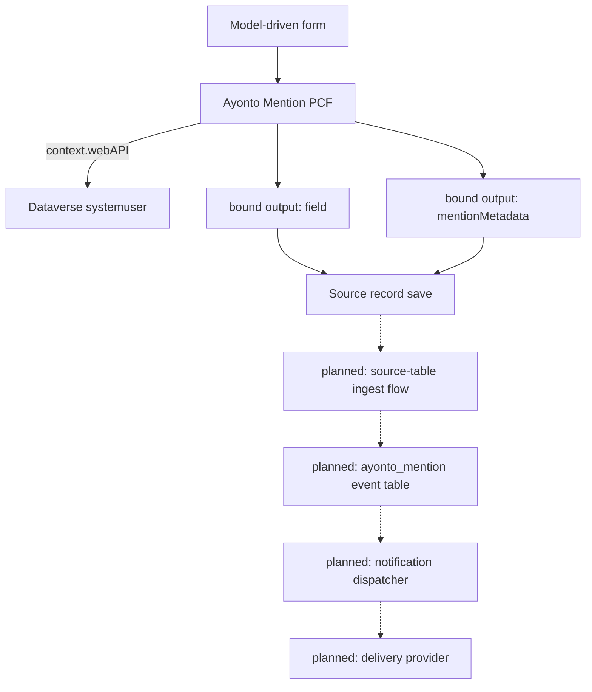

# Ayonto Mention

[](https://github.com/Ayonto-Digital-Solutions/ayonto-mention/actions/workflows/ci.yml)
[](LICENSE)
[](#current-status)

Ayonto Mention is a reusable `@mention` field control for Microsoft Power Apps and
Dataverse. It brings people-aware mentions to ordinary Dataverse text columns and
carries the identity of each mention out with the record, so that a server-side
step can turn it into a notification after the record is actually saved.

Version 1 targets **model-driven Power Apps**. The control is in active
development toward v1.0.0, and the notification backend is designed but not yet
implemented: **nothing is sent today.**

## What is Ayonto Mention?

Someone writes in a normal text field — a comment, a note, a description. They
type `@`, a few letters of a colleague's name, pick the right person from the
list, and keep writing. The text reads exactly as they typed it.

What makes that useful is what happens underneath: the control remembers **which
person** was picked, separately from the name on screen. Text cannot carry that.
Two colleagues called "Robin Fox" produce identical characters, and a name typed
out by hand looks the same as one chosen from the list.

Keeping identity apart from text is what gives the control these properties:

- **Namesakes stay distinct.** Two people with the same display name are two
  different mentions, told apart by their Dataverse user id.
- **A typed name is nobody.** Writing `@Alex Rivera` by hand does not make it a
  mention. Only picking a person does.
- **Mentions survive editing.** Typing in front of a mention, or anywhere else in
  the field, moves it without losing who it means.
- **Mentions survive saving.** A saved record carries the identities with it, so
  reopening it continues the same mentions rather than starting new ones.
- **One person, one episode.** While a colleague is mentioned at all, every
  occurrence of them shares one `eventId` — naming them twice is still one
  episode. Removing the last occurrence ends it; mentioning them again starts a
  new episode with a new `eventId`. Nothing is dispatched and no event record is
  created: the identifier travels with the record for a later server-side step.

## Current status

Everything below is about the **client**. The server side does not exist yet.

| Area | Status |
|---|---|
| Virtual React code component, Fluent UI v9 interface, English and German resources | ✅ implemented |
| `@` picker over Dataverse `systemuser`, debounced search, keyboard navigation, IME-safe commit | ✅ implemented |
| Mentions kept apart by user id, hand-typed names left as ordinary text | ✅ implemented |
| Mention re-anchoring across edits, whole-mention Backspace/Delete, character counter and `MaxLength` | ✅ implemented |
| Column security: unreadable columns masked, read-only columns not editable, unwritable companion column disables mentioning | ✅ implemented |
| Offline handling through `context.client`: typing continues, picker closes with a localized notice | ✅ implemented |
| Bound text output and bound companion-metadata output, reconciled as one host state | ✅ implemented |
| Saved mentions read back on reopen, with their occurrence positions and event identities | ✅ implemented |
| Read mode showing saved mentions as person tokens; one click or Enter/Space starts editing with the caret in the field | ✅ implemented |
| Identity confirmed against Dataverse before a saved mention becomes clickable; anything unconfirmed stays ordinary text | ✅ implemented |
| Clicking a confirmed token opens that `systemuser` through `context.navigation.openForm` | ✅ implemented |
| Automated tests and CI | ✅ implemented |
| Suggestion popup portalled and positioned against the field, through Fluent's positioning: opens below, flips above where there is no room, stays inside the viewport, follows the field when a form pane scrolls | ✅ implemented in code — the flipping, shifting, scrolling and resizing are a browser's arithmetic and are checked in a real environment, not in the test suite |
| `ayonto_mention` event table, ingest flows, dispatcher, delivery | ⏳ planned, see [Roadmap](#roadmap) |

**Selecting a mention does not send anything today.** The control writes the text
and the mention metadata as bound outputs. It writes nothing to Dataverse itself:
its only Web API calls are a `systemuser` search and a single-user read.

## How it works



Solid arrows are implemented today. Everything marked *planned* is designed but
does not exist in this repository yet.

The control exposes the text and the companion metadata as bound outputs. The
server-side notification pipeline is designed to process those values only after
the source record has been committed.

## Component configuration

The maker configures four properties, from
[`ControlManifest.Input.xml`](pcf/MentionControl/ControlManifest.Input.xml):

| Property | Usage | Required | Type | Purpose |
|---|---|---|---|---|
| `field` | bound | yes | `Multiple`, `SingleLine.Text`, `SingleLine.TextArea` | The ordinary Dataverse text column the editor reads and writes |
| `recordId` | input | yes | `SingleLine.Text` | The record the mentions belong to |
| `recordTable` | input | yes | `SingleLine.Text` | Logical name of the source table |
| `mentionMetadata` | bound | yes | `Multiple` | The hidden companion column carrying the mentions |
| `minRows` | input | no | `Whole.None` | Smallest height of the field, in rows of text. Default 3, clamped to 1–30 |

The record id and table are configured explicitly because the framework offers no
supported, generic way for a control to learn which record it sits on. The column
name is *not* asked for — it is read from the bound field's own metadata.

**Why the height is configured rather than detected.** The height a maker draws
in the form designer lives in the cell's rowspan, and a code component is not
told it: in a model-driven app `updateView` reports
[`allocatedHeight` as `-1`](https://learn.microsoft.com/en-us/power-apps/developer/component-framework/reference/mode/trackcontainerresize)
whether or not `trackContainerResize` is switched on. Measuring the box the host
put the control in would mean reaching outside the component, which is
[not supported](https://learn.microsoft.com/en-us/power-apps/developer/component-framework/code-components-best-practices#avoid-using-unsupported-framework-methods),
so this control does not do it. `minRows` is the supported answer: the maker says
it, the field and its read view share that one minimum, and the field still
resizes vertically and grows with its content. It is optional with a default, so
forms configured before it existed keep working — a newer version of an imported
code component
[may add optional properties but not required ones](https://learn.microsoft.com/en-us/power-apps/developer/component-framework/faq#cannot-add-remove-properties-from-code-component-once-it-is-imported).
How this looks on a real form is checked in the DEV environment, not in the test
suite.

**One companion column per mention-enabled text column.** A Dataverse column holds
exactly one value, and each control instance writes its own. Two mention editors
sharing a companion column would silently overwrite each other's metadata, so each
mention-enabled text column gets its own, configured hidden.

## Companion metadata

The companion column carries `schemaVersion` 1:

```json
{
  "schemaVersion": 1,
  "sourceField": "description",
  "mentions": [
    {
      "eventId": "00000000-0000-4000-8000-000000000000",
      "recipientUserId": "00000000-0000-0000-0000-000000000000",
      "occurrences": [
        {
          "start": 6,
          "length": 12
        }
      ]
    }
  ]
}
```

| Field | Meaning |
|---|---|
| `schemaVersion` | The payload version. Anything else is not read. |
| `sourceField` | Logical name of the text column these mentions were written in. Server-side processing is designed to validate it against configured mappings rather than trust it. |
| `eventId` | Client-generated identity for one mention episode, carried so a later server-side step can be idempotent about it. It identifies; it authorizes nothing. |
| `recipientUserId` | The Dataverse `systemuser` id. Display names are deliberately never identity. |
| `occurrences` | Where that person stands in the text, as UI state — see below. |

`start` is a zero-based UTF-16 string index — the same index JavaScript strings
use — and points at the `@`. `length` covers the whole visible `@Display Name` and
stops there. `"Hello @Anna Berger today"` gives `start: 6, length: 12`.

**Occurrence positions are editor state, not authority.** They exist so a saved
record can be reopened and read as people rather than characters. They say nothing
about who may be notified, and a server-side step must never treat one as a reason
to notify anybody.

The payload deliberately does **not** contain the recipient's display name, their
email address, their job title or avatar, a copy of the text, the record id, the
table name, or any tenant or environment identifier.

Two reasons. The column sits on a business record and is writable by anyone who
may write the text column, by any means — so a name or address read from it would
be whatever the writer chose, not what Dataverse knows. And storing colleagues'
personal data in a hidden column on an unrelated record, for as long as that
record exists, is not something a mention needs in order to work.

## Mentions across sessions

A saved record carries `recipientUserId`, `eventId` and occurrence positions, so
reopening it does not start over. Reading them back is deliberately done in two
separate steps, because a position is not a person.

1. **Structural hydration.** The stored payload is treated as something a stranger
   wrote: version, column, identifier shapes, and every span are checked against
   the text actually in front of the control. A span must begin at an `@` that
   could have opened a mention and end where a mention may end, so a stored
   `@Alex Rivera` is not drawn over `@Alex RiveraX`. Anything structurally wrong
   ends the whole payload; a single span the text no longer supports is dropped
   and the rest kept. Nothing is repaired and nothing is written back.
2. **Identity confirmation.** Before a saved mention becomes a person you can
   click, the control reads that exact user through
   `context.webAPI.retrieveRecord("systemuser", id, "?$select=systemuserid,fullname")`
   and compares the result with the name standing in the text. Only a match
   becomes an interactive token.

Everything else — a name that no longer matches, a deleted user, a read the user
is not allowed to make, no connection at all — **falls back to ordinary text**.
Never to a possibly wrong clickable person.

This matters in ordinary cases, not just exotic ones. The same record can be saved
again by somebody else with the same sentence and a different Robin Fox behind the
name; the control follows the metadata, not the characters, and adopts text and
identities together so that no edit ever writes back a person who is no longer
meant.

Failing to confirm changes nothing about the record: no output, no save, no
rewrite of the payload. Opening a record with no connection leaves the metadata
exactly as it was, typing still carries the recorded identities along with the
text, and the confirmation simply happens once the control is given an online
context again.

## Privacy and security

- The control declares `external-service-usage` as disabled: no third-party calls.
- All Dataverse access stays inside the environment the control already runs in,
  over the documented `context.webAPI` surface, and is read-only: the control
  makes no create, update or delete call. It uses `retrieveMultipleRecords` for
  the user search and `retrieveRecord` to confirm a saved identity, and nothing
  else. Edits to `field` and `mentionMetadata` leave the control as bound
  outputs, which the host form persists with the record like any other value.
- No `Xrm`, no form context, no `contextInfo`, no host DOM traversal, no
  hand-built Dataverse URLs.
- Neither display names nor email addresses are persisted into `mentionMetadata`.
- Dataverse errors are never shown or logged: they can carry the environment URL
  and schema names with them.
- **`mentionMetadata` is client-supplied input.** Hiding a column on a form is not
  a security boundary: anyone who may write the text column may write the
  companion column too. That the control confirmed a user well enough to draw a
  token is a *display* decision made in one browser, and grants a future server
  nothing.
- Any server-side processor must therefore resolve and validate recipient identity
  itself before anything is delivered. The designed notification identity is
  `eventId` + `recordTable` + `recordId` + `sourceField` + `recipientUserId`;
  occurrence positions are not part of it.
- Delivery, when it exists, is intended as best-effort. No exactly-once or
  guaranteed-delivery claim is made.

This repository is public and must stay customer-neutral — no tenant or
environment identifiers, no real addresses, no customer schema. See
[CONTRIBUTING.md](CONTRIBUTING.md); to report a vulnerability, see
[SECURITY.md](SECURITY.md).

## User lookup

The picker queries the Dataverse `systemuser` table through `context.webAPI`,
debounced while typing. It excludes:

- disabled users
- application users
- the **Support User** access mode
- the **Non-interactive** access mode

An organisation whose configuration refuses to filter on those columns is not left
without a lookup: the query is retried without them and the accounts are removed
from the result instead. Mailbox validation belongs to the designed notification
pipeline and is not implemented yet.

## Requirements

- Microsoft Dataverse
- **Model-driven Power Apps.** Canvas apps are not a v1 target: `context.webAPI`
  is documented as available for model-driven apps and portals only, and
  `context.client.isOffline` / `isNetworkAvailable` and
  `context.navigation.openForm` are documented for model-driven apps.
- Platform libraries: the manifest declares React `16.14.0` and Fluent
  `@fluentui/react-components` `9.46.2`, and the npm dependencies are pinned to
  exactly those versions, so the control is written against the API surface it
  declares. Power Apps may load a higher compatible runtime version of a platform
  library.
- Node.js ≥ 24 for development

## Development

Everything lives in [`pcf/`](pcf); the repository root forwards the usual commands
there, so these work from the root of the clone:

```bash
npm ci --prefix pcf     # install exactly what package-lock.json pins
npm run build
npm run lint
npm run typecheck
npm test
```

Also available:

```bash
npm run test:coverage
npm run start           # PCF test harness
```

Running them from inside `pcf/` works too — there, use plain `npm ci`.

## Repository structure

```
.
├── pcf/
│   ├── MentionControl/     # PCF manifest, resources and framework adapter
│   ├── src/                # domain logic, components, hooks, services
│   └── tests/              # Jest suites
├── powerplatform/
│   └── src/                # reserved Dataverse solution source
├── CONTRIBUTING.md
├── SECURITY.md
└── README.md
```

`pcf/src/` holds platform-neutral domain logic — text anchoring, episode tracking,
the metadata format, hydration — with the framework adapter kept separate, which is
why most of it is directly unit testable.

`powerplatform/src/` is reserved for the generated Dataverse solution source and
currently contains placeholders only. **Power Platform YAML must not be
hand-authored** — every artefact is produced by supported PAC CLI or Dataverse
tooling and then committed. See [powerplatform/README.md](powerplatform/README.md).

## Design principles

- Documented platform APIs, never host internals or undocumented behaviour.
- Model-driven first; canvas support is a separate undertaking, not an assumption.
- The smallest client payload that can work.
- Identity is a Dataverse user id, never a display name.
- When identity cannot be proven, fail closed to ordinary text.
- The server trusts nothing the client sends.
- Domain logic is pure, deterministic and directly testable.
- The public source stays customer-neutral.
- No hand-authored solution or flow schema.

## Roadmap

1. PCF editor, companion metadata, persisted mention identity and viewport-aware
   suggestion positioning — **implemented**
2. Neutral Ayonto Dataverse development environment — also where the suggestion
   popup's flip, shift, scroll and resize behaviour gets verified against a real
   browser
3. Generate the solution and schema with supported Microsoft tooling
4. `ayonto_mention` event ledger with its alternate key
5. Table-specific ingest flow
6. Generic notification dispatcher
7. Delivery channels and their configuration
8. Integration, concurrency and solution-import testing
9. Package and publish v1.0.0

No release date is promised.

## Contributing

See [CONTRIBUTING.md](CONTRIBUTING.md). The customer-neutrality rules apply to
every contribution, including issues and screenshots.

## License

MIT
