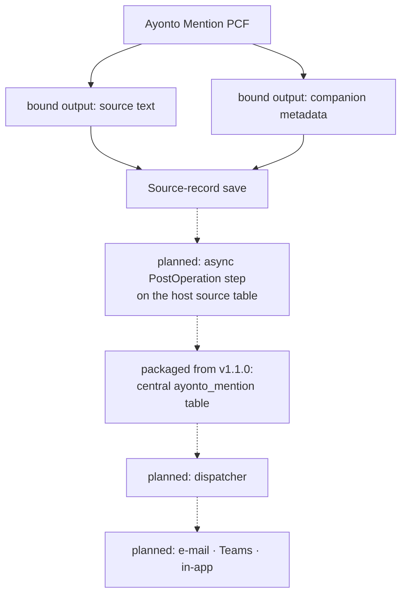

# Server-side architecture

How a mention becomes a notification, and which solution owns which part of that.

**One part of this now exists, and it is worth being exact about which.** From
v1.1.0 the solution package installs the central `ayonto_mention` table: the
schema is shipped. Nothing writes to it. The ingest step, the dispatcher and
every delivery channel described below are still designed and unbuilt, so a
mention still becomes a bound output on a business record and stops there.

The rest is written down so that the implementation, when it happens, is the
implementation of a decision rather than a rediscovery of one — and so that the
routes already considered and rejected stay rejected.

The client half is documented in the [README](../README.md). It ends where this
document begins: the control writes a text column and a companion metadata
column as bound outputs, the host form saves the record, and that save is the
only commit boundary there is.

## The shape of it

Solid arrows exist today. Everything dotted is designed and unbuilt — with one
exception: the ledger box is a table that v1.1.0 actually installs. The arrows
into and out of it are not.

**Packaged is not implemented.** The table being present in an environment says
nothing about anything writing to or reading from it, and this document should
not be read as if it did.

## Two solutions, and why

A mention control is reusable. The tables people write mentions in are not: they
belong to whichever application the customer actually runs. That difference is
not an inconvenience to design around — it is the seam the packaging follows.

### The base product solution — `AyontoMention`

Owns everything that is the same for every host:

- the code component `Ayonto.AyontoMentionControl` — **shipped**
- the central `ayonto_mention` table, its columns and its view — **shipped from
  v1.1.0**, reused unchanged from the legacy product's export rather than
  designed here
- the plug-in package, assembly and plug-in types
- the security components the ledger needs
- later: the dispatcher and per-channel delivery state

### The host solution

Owns everything that is specific to one application:

- its own business tables and the text columns people write in
- **one companion metadata column per mention-enabled text column**
- the form bindings to `Ayonto.AyontoMentionControl`
- the concrete SDK message processing steps registered on its source tables
- the mapping from each text column to its companion column
- whatever presentation or delivery configuration is particular to that host

The host solution therefore declares a dependency on `AyontoMention`, and
Dataverse enforces it: the base solution must be installed first, and it cannot
be uninstalled while a host solution still depends on it.

## Why the host owns the companion columns

Not a limitation worked around — a property of how solutions are built.

A column is a solution component that lives inside a table, and Microsoft states
the constraint plainly: *"Each of those components requires a table to exist.
Except for choice columns, all other columns can't exist outside of a table"*
([Solution concepts](https://learn.microsoft.com/en-us/power-platform/alm/solution-concepts-alm)).
A solution carries columns for the tables it names while it is being built — that
is ordinary, and it is exactly what the host solution does for its own tables.

What the reusable base solution cannot do is **predeclare host-specific companion
columns on arbitrary host tables it does not know**. `AyontoMention` is built long
before it knows which application will use it, and a component cannot name a table
that has not been chosen yet. No mechanism changes that, and looking for one is
looking for a way around solution composition rather than with it.

The host application, on the other hand, knows its own tables exactly. Adding a
companion column there is ordinary schema work in the solution that already owns
the table it belongs to.

There is a second reason to want it that way. Uninstalling a managed solution
removes *"data stored in custom columns that are part of the managed solution on
other tables that aren't part of the managed solution"* (same article). A
companion column shipped by the base product would take its contents with it
whenever the base product were removed — including from a host that still
wanted them.

**A reusable base solution plus a dependent host solution is the intended
packaging model, not a shortfall in it.**

## The step model

For each mention-enabled source table, the host solution registers two steps
against the plug-in type supplied by `AyontoMention`.

### `Create`

| Setting | Value |
|---|---|
| Message | `Create` |
| Primary Entity | the host source table |
| Stage | PostOperation |
| Execution mode | **Asynchronous** |
| Post Image | only the source text columns and their companion metadata columns |

Early exit when the image carries no mention metadata, which is the ordinary
case for a record created without mentioning anybody.

### `Update`

| Setting | Value |
|---|---|
| Message | `Update` |
| Primary Entity | the host source table |
| Stage | PostOperation |
| Execution mode | **Asynchronous** |
| Filtering Attributes | **only the companion metadata columns** |
| **Pre Image** | **the companion metadata columns, for the before/after comparison** |
| Post Image | the source text columns and their companion metadata columns |
| Unsecure Configuration | the mapping from each text column to its companion column |

The handler compares the metadata in the pre image against the metadata in the
post image and returns without touching the ledger when nothing meaningful moved.
That comparison is not an optimization that can be skipped — see below.

### Why each of those

**A step per host table rather than one global step.** A step registered with no
primary entity runs for every table that supports the message — *"If a primary
entity isn't specified for core messages like `Update`, `Delete`, `Retrieve`, and
`RetrieveMultiple` … the plug-in will be invoked for all entities that support
that message"*
([Register a plug-in](https://learn.microsoft.com/en-us/power-apps/developer/data-platform/register-plug-in)).
That would mean an invocation on every update of every table in the environment,
including tables this product has nothing to do with. It would also forfeit
filtering attributes, which the same article ties to having set a primary entity.
Registering against the host's own table costs the host one declaration and
spares the environment all of it.

**Filtering on the companion columns only.** Microsoft's guidance is explicit:
*"If no filtering attributes are set for a plug-in registration step, then the
plug-in executes every time an update message occurs for that event"*, and warns
that this combines badly with auto-save
([Include filtering attributes](https://learn.microsoft.com/en-us/power-apps/developer/data-platform/best-practices/business-logic/include-filtering-attributes-plugin-registration)).
Filtering to the companion columns is the right registration-level optimization:
an update that carries none of them does not reach this step at all.

**What a filtering attribute does not tell you.** It fires on *presence in the
request*, not on change. Microsoft states it twice, and plainly — *"If a request
contains a filtering attribute, the plug-in will be triggered regardless of
whether the attribute's value is changed or not"*
([Register a plug-in](https://learn.microsoft.com/en-us/power-apps/developer/data-platform/register-plug-in)),
and *"Whether the values are actually changed isn't relevant"* (Include filtering
attributes). Both articles add the corresponding expectation of the caller:
*"Only changed values should be included in the payload of update requests."*

Whether this control's host meets that expectation is **not known yet**. The
control's `getOutputs` returns both bound outputs — the text and the companion
metadata — on every cycle, because they describe one moment of the editor and are
set together. What a model-driven form then puts into the Dataverse `Update`
request is the host's decision, and nobody here has watched it make that decision
on a text-only edit.

So the rule the implementation must hold to is:

> **"The step was invoked" does not mean "the metadata changed."**

The handler establishes that for itself, by comparing the pre-image metadata with
the post-image metadata, and returns when they match. Note what this does and
does not save: if an unchanged companion column *was* included in the request, the
asynchronous system job has already been queued by the time any of our code runs,
and the comparison only lets the handler exit cheaply and safely. It does not
avoid the invocation.

None of that weakens the case the product exists for. When one person is swapped
for another behind identical visible text — two colleagues share a display name,
the writer picks the other one — the text does not change by a single byte, but
`recipientUserId` and `eventId` in the companion column do. That is a real
metadata change, the comparison sees it, and it must be processed.

**Asynchronous, not synchronous.** A synchronous PostOperation step runs *"within
the database transaction"*, and *"An exception thrown by your code at any
synchronous stage within the database transaction causes the entire transaction
to roll back"*
([Event framework](https://learn.microsoft.com/en-us/power-apps/developer/data-platform/event-framework)).
That would make a notification defect capable of refusing somebody's business
record. Asynchronous PostOperation steps *"run outside of the database
transaction using the asynchronous service"* (same article), so the record is
already saved and durable when the work begins, and no failure in it can take the
save back. A notification is not part of the customer's transaction and must not
behave as if it were.

The reason this is affordable is the host-specific registration. An asynchronous
step queues a system job whenever it matches, before any of our code could
decide otherwise — so a *global* asynchronous step would queue a job for every
update in the environment.

Filtered to one host table and its companion columns, a job is queued only when
the `Update` request contains at least one of those companion attributes. That is
the whole of what the registration decides — presence, not change. Where an
unchanged `mentionMetadata` was included in the request anyway, the job has
already been queued before any of this product's code exists to object, and it is
the handler's pre/post metadata comparison that keeps it from doing ledger work.

The same-display-name case is on the other side of that comparison and stays
there: a changed `recipientUserId` or `eventId` behind byte-identical visible text
is a real metadata change, and it is processed.

**Post images rather than a retrieve.** A post image *"captures a 'snapshot' of
the table with the fields you're interested in"*, and Microsoft names retrieving
the values instead as *"not a good practice for performance"* (Register a
plug-in). The same article records the two constraints that matter here: a post
image is available only for PostOperation steps, and `Create` and `Update` both
support images. The default of selecting all columns is explicitly warned
against — the image carries the text and metadata columns and nothing else.

**Mapping in the unsecure configuration.** Which text column a companion column
belongs to is knowledge the host has and the base product cannot infer. It
travels with the step that the host registered. Secure configuration would not
work for this: it *"isn't included with the step registration when you export a
solution"* (Register a plug-in), and this mapping is not a secret — it is part of
the declaration.

## Cross-solution ownership

The plug-in assembly and its types belong to `AyontoMention`. The concrete steps
belong to the host solution. There is no such thing as half a step: in Dataverse
a step *is* the registration — the message, the table, the stage, the mode, the
filters and the handler, in one component.

Both halves are solution components. *"**Sdk Message Processing Steps** are also
solution components and must also be added to an unmanaged solution in order to
be distributed"* (Register a plug-in), and the same article describes this exact
arrangement when adding a step without its assembly: *"The only time you wouldn't
select this is if your solution is designed to be installed in an environment
where another solution containing the assembly is already installed."*

That is the host solution's situation precisely. It carries the steps; the base
solution carries the assembly they point at; the dependency between them is
declared and enforced.

## What the server may believe

The companion column sits on a business record and is writable by anyone who may
write the text column. Everything in it arrives as a claim.

### Untrusted — from the companion column

`schemaVersion` · `sourceField` · `eventId` · `recipientUserId` · `occurrences`

Each is validated, none is believed on its own:

- an unknown `schemaVersion` is refused, never guessed at
- `sourceField` is accepted only where it matches the step's own configuration —
  the mapping the host declared, not the value the payload asserts
- `recipientUserId` is resolved against `systemuser` and checked for being a real,
  enabled user before anything is written about them
- `occurrences` may be checked for structural sense against the text in the image,
  and may never authorize anything. They exist so a saved record can be reopened
  and read as people rather than characters
- a display name or an e-mail address is never an identity, wherever it came from

### Trusted — from the execution context

The table, the record id, the initiating user, the operation, the committed state
in the image. These come from the platform, not from a payload.

### `eventId` identifies; it does not authorize

It exists so that processing the same episode twice does not notify twice:

| Situation | Meaning |
|---|---|
| same `eventId`, same immutable identity | a replay — no-op |
| same `eventId`, different immutable identity | a conflict — refuse, do not overwrite |

The immutable identity of a notification stays
`eventId` + `recordTable` + `recordId` + `sourceField` + `recipientUserId`.
Occurrence positions are not part of it and never become part of it.

## Who may write the ledger

The control never writes a ledger row. That is a property of the client, and a
client-side property secures nothing on its own: if ordinary users held Create
privilege on the ledger, someone could post a forged notification event straight
at the Web API and never involve the control at all.

So the privilege must not be granted. **That is a target, and v1.1.0 does not
yet reach it.**

**The target:** ordinary application users must not *require* direct `Create`,
`Update` or `Delete` on the central ledger. They save host records; the trusted
server ingest authors events. Once that ingest exists, the security design denies
those direct event-authoring privileges.

**What v1.1.0 actually does about it: nothing.** The package carries **no
security role**. It does not change the privileges an environment already has
configured, and it therefore cannot guarantee what any given user can do to this
table today. Dataverse decides that through security roles — *"Create: required
to make a new record"*, *"Write: required to make changes to a record"*,
*"Delete: required to permanently remove a record"* — and the roles a user holds
combine: *"Security role privileges are cumulative"*
([Security roles and privileges](https://learn.microsoft.com/en-us/power-platform/admin/security-roles-privileges)).

**And in a migrating environment it must stay that way for now.** The legacy
control writes `ayonto_mention` rows from the browser, so an environment still
running it may well grant its users exactly the direct access this design wants
to remove. Taking that access away as part of a packaging release would break the
legacy control before anything has replaced it. Restricting direct ledger writes
belongs to the server cutover, not here.

So: **table ownership is decided now. Direct-write privileges are not.** Two
different decisions, and this release makes only the first.

### The ledger is user-owned, and that is now a decision

An earlier draft of this document said the ledger was *planned as
OrganizationOwned unless validation gave a reason to change it*. That sentence
has been withdrawn, because it described a choice that is not available.

From v1.1.0 the solution packages the existing `ayonto_mention` table, and that
table is **UserOwned**. Not provisionally: Microsoft is explicit that *"Once a
table is created, the ownership type can't be changed"*, and again — *"After you
create a custom table, you can't change the ownership… If you later determine
that your custom table must be of a different type, you need to delete it and
create a new one"*
([Types of tables](https://learn.microsoft.com/en-us/power-apps/maker/data-platform/types-of-entities)).

So the ownership is not packaging metadata a later release can flip. It is part
of the table, and taking over the existing table means taking over its ownership.

**That is the intended trade, deliberately made.** This product is succeeding the
legacy component rather than replacing its schema: the same logical table, the
same columns, already depended on by an installed application. Recreating it as
organization-owned would mean a different table, a migration of whatever it
already holds, and a broken dependency for anything that points at the old one —
in exchange for a property that the privilege model above already provides.

**User-owned is not the legacy trust model returning.** The two are unrelated
questions. Ownership decides how row-level access is *scoped* once a privilege
exists; it does not grant the privilege, and record ownership on its own confers
nothing. Dataverse authorization remains a matter of security role privileges —
which is exactly why choosing user ownership changes nothing about the intended
boundary, and also why this release cannot enforce that boundary: it ships no
role. Both of those follow from the same fact.

If some future requirement genuinely needed organization ownership, it would need
a different table and an explicit data-migration design. **That is not the plan,
and nothing here should be read as leaving the door open to it as a small later
change.**

**The ingest plug-in is the trusted writer**, and Dataverse has a documented way
to say so. `IOrganizationServiceFactory.CreateOrganizationService(userId)`:
*"When called in a plug-in, a `null` value indicates the SYSTEM user and a
`Guid.Empty` value indicates the same user as `IPluginExecutionContext.UserId`.
Any other value indicates a specific system user"*
([CreateOrganizationService](https://learn.microsoft.com/en-us/dotnet/api/microsoft.xrm.sdk.iorganizationservicefactory.createorganizationservice?view=dataverse-sdk-latest)).
Passing `null` is how the authoritative ledger write happens without the calling
user needing a privilege they should not have.

**SYSTEM is a privilege, not a reason to believe anything.** It says who may
write the row. It says nothing about whether the row deserves to exist. Every
check in the next section still runs first: schema version, the `sourceField`
mapping the host declared on its own step, the `eventId` rules, `recipientUserId`
resolved against `systemuser`, and the structural sense of the payload. Elevated
context applied to unvalidated input is worse than no elevation at all, because it
launders a claim into a fact.

Use it narrowly: for the Ayonto-owned operations that require it, and for nothing
else.

**The actor is still the user.** `InitiatingUserId` from the execution context is
the trusted identity of whoever caused the source-record operation, and that is
what the event records as its actor. Writing the row as SYSTEM does not make the
event anonymous — it separates *who did it*, which comes from the platform, from
*who may persist it*, which is a permission question.

## Delivery

Out of scope for the ingest work, and listed here so its scope is not quietly
lost: the dispatcher is expected to cover **e-mail, Teams and in-app
notification** — three channels, not one.

Delivery state is kept **per channel**. One column cannot mean both "the mail
arrived" and "the chat message did not", so it does not try to.

External delivery is **best-effort**. No exactly-once or guaranteed-delivery
claim is made anywhere in this product.

## Routes not taken

| Rejected | Why |
|---|---|
| The client writing ledger rows directly | Puts the commit boundary in a browser. A record abandoned without saving would still have notified somebody |
| A separate command row committed independently of the save | Same defect in a different shape, plus a second write path into the source text. The source-record save is the commit boundary, and there is only one |
| One global step with no primary entity | Runs on every table in the environment and cannot use filtering attributes |
| A central table mapping every text column to its companion column | Unnecessary once the host registers its own steps — see the note below |
| A Power Automate ingest flow per source table | Not chosen — see the note below. Power Automate is supported server-side technology; it is simply not the mechanism this architecture uses |
| Synchronous ingest inside the save transaction | Lets a notification defect refuse somebody's business record |

**On the mapping table specifically.** No central Ayonto table is needed to say
which text column a companion column belongs to. The host-owned step carries that
mapping in its unsecure configuration, and the step is registered against the
host's own table — so the registration is the mapping, and it is authoritative
because of who is able to make one, not because of what created it.

That distinction matters, and an earlier draft of this document got it wrong.
A step is an ordinary `SdkMessageProcessingStep` row: the Plug-in Registration
tool creates and edits such registrations directly, and unregistering is
described as *"delete operations on the `PluginAssembly`, `PluginType`,
`SdkMessageProcessingStep`, and `SdkMessageProcessingStepImage` tables"*
([Register a plug-in](https://learn.microsoft.com/en-us/power-apps/developer/data-platform/register-plug-in)).
Solutions are how a step is *distributed*, not the only way one can exist — the
same article is explicit that registrations *"aren't added to the unmanaged
solution that includes the plug-in assemblies. You must add each registered step
to the solution separately."*

So the guarantee is not "only a solution can create one". It is that creating or
changing a registration takes privileged Dataverse customization access, which
ordinary users writing a business record do not have — while a row in a mapping
table would be as writable as whoever held privileges on that table. The host
solution then packages and ships the concrete step, which is what makes the
mapping travel with the application that declared it.

**On the flow option specifically.** Nothing here should be read as a claim that
Power Automate is unsupported, or an untrustworthy place to run server-side logic.
It is neither. The host-owned plug-in step is chosen because it fits *this*
product better:

- one shared, versioned server implementation rather than one per host
- the table registration is owned and declared by the host solution
- filtering attributes and entity images are available to it
- the ingest needs no Dataverse connector connection reference, so importing the
  base solution asks for no connection
- it composes cleanly as a reusable base solution plus a dependent host solution

## What must be proven in a real environment

None of this is finished until it has run somewhere. The following are proofs,
not features, and none of them can be claimed from documentation alone:

- registering both steps against a plug-in type supplied by a *different*
  installed solution
- exporting those steps with the host solution and importing them as managed
- the declared dependency between host and base solution behaving on import,
  upgrade and uninstall
- post images arriving with the expected columns on both `Create` and `Update`,
  and the `Update` pre image carrying the metadata needed for the comparison
- **whether a text-only edit through this control puts the unchanged companion
  metadata column into the Dataverse `Update` request at all** — the control emits
  both bound outputs on every cycle, and what the host forwards is unverified
- what filtering attributes then actually do with that payload
- an asynchronous failure leaving the source-record save untouched
- the same-display-name replacement waking the `Update` step
- unsecure configuration surviving export and import
- an ordinary user saving a host record **without** holding `Create` on the ledger
- the ingest plug-in writing the authoritative ledger row under the SYSTEM context
- an ordinary user being unable to create, update or delete ledger rows directly
- the ledger staying unreadable to ordinary callers, over both the Web API and TDS

Until an Ayonto Dataverse development environment exists, none of this is built,
and no production solution source is hand-authored. See
[`powerplatform/README.md`](../powerplatform/README.md).
