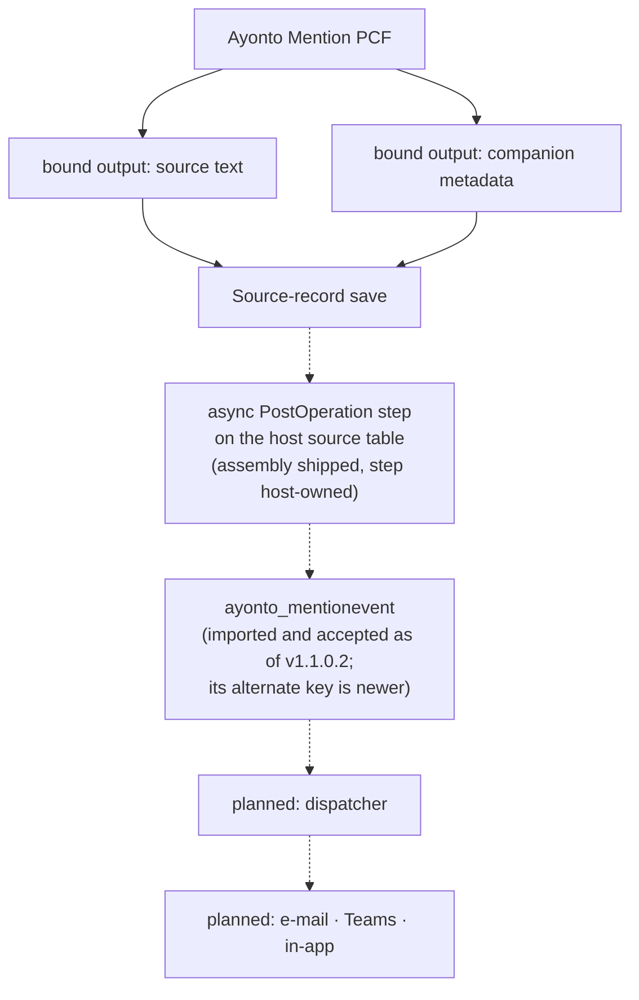

# Server-side architecture

How a mention becomes a notification, and which solution owns which part of that.

**Some of this now exists, and it is worth being exact about which.** From
v1.1.0 the solution package installs the central `ayonto_mention` table, and the
1.1.0.1 candidate adds the product's own `ayonto_mentionevent` alongside it: both
schemas are in the package.

**The ingest described below is implemented and, from solution `1.2.0.0`, shipped.**
It lives in [`server/`](../server/README.md) as a net48 plug-in assembly with unit
tests, it creates `ayonto_mentionevent` rows and nothing else, and both the managed and
the unmanaged package now carry it along with its plug-in type.

What it has still not done is **run**. The base solution carries the assembly; it
carries no step, because a step names a host table and therefore belongs to the host
application's own solution. So importing this package registers a handler that nothing
calls yet, and no event row has ever been created in a Dataverse environment.

The dispatcher and every delivery channel described below are still designed and
unbuilt, so a mention still becomes a bound output on a business record and stops
there.

**`ayonto_mention` is not the new product's ledger, and nothing in the ingest
writes to it.** The two tables are one suffix apart and shared a purpose for a
while; the second is the legacy product's, it is user-owned, and its columns carry a
recipient's name and address. The new ledger is `ayonto_mentionevent`, the ingest
targets only that, and a test reads the ingest's own sources to keep it that way.

**Which matters when reading a live environment.** Neither half of this product writes
`ayonto_mention`: the control makes no `createRecord` call against either table, and the
ingest writes only `ayonto_mentionevent` — with no step registered, it writes nothing at
all. The legacy control does write that table, directly from the browser.

So a fresh `ayonto_mention` row proves that an active legacy or external writer is still
present in the environment, and that it is not this product. The legacy control is one
known direct writer; it is not the only thing that *could* write a table, and an old flow
or process would look the same from the row alone. Correlate the row's `Created On` and
`Created By` with the form's actual control configuration before naming the source.

**The table has now been through a real import.** `v1.1.0.2` managed was imported
into the neutral Ayonto development environment and accepted, which is what proved
the `OrgOwned` serialization corrected after v1.1.0.1's `0x80044150` rejection. The
event table is no longer only a file in this repository.

**And `v1.1.0.3` went in after it**, so the alternate key on `ayonto_EventId` has been
accepted by a real import too. What has *not* been read is that key's
`EntityKeyIndexStatus`: Dataverse builds the supporting index asynchronously, the status
runs Pending → In Progress → **Active** or Failed, and only Active means the uniqueness
is enforced. Accepted is therefore not the same claim as working.

The plug-in assembly is newer still: it ships from `1.2.0.0`, and no environment has
imported a package that carries it.

The rest is written down so that the implementation, when it happens, is the
implementation of a decision rather than a rediscovery of one — and so that the
routes already considered and rejected stay rejected.

The client half is documented in the [README](../README.md). It ends where this
document begins: the control writes a text column and a companion metadata
column as bound outputs, the host form saves the record, and that save is the
only commit boundary there is.

## Target architecture

**Most of this section is still a target, and the parts that are not are named
where they appear.** What exists is the event table's solution source, shipped
since v1.1.0.1, and — from this change — the ingest and the authoritative
configuration resolution, implemented in code and unit-tested, with their
environment registration and import proof still pending. The dispatcher and every
delivery channel are unbuilt. It is recorded so the shape is settled before
anything is written against it, and so the places that are *not* settled are
visible rather than assumed.

### The product event table

The table that belongs to this product and to nothing else first shipped as
solution source in v1.1.0.1:

| | |
|---|---|
| Display name | Mention |
| Schema name | `ayonto_MentionEvent` |
| Logical name | `ayonto_mentionevent` |
| **Ownership** | **Organization-owned** |
| **`OwnershipTypeMask`** | `OrgOwned` |

**Those last two rows are one decision written two ways.** Dataverse names
the ownership model `OrganizationOwned`; solution XML serializes that model
as `OrgOwned`. The v1.1.0.1 package carried the model's name as the raw
`<OwnershipTypeMask>` value, and the real managed import rejected the table
with `0x80044150`, *Requested value 'OrganizationOwned' was not found*. The
1.1.0.2 candidate writes `OrgOwned`. The ownership model did not change.

It is a **separate component from the table the current release packages**, not a
rename of it.

**Organization ownership is a deliberate choice for this table**, and it has to be
made now rather than later: ownership is picked when a table is created and
*"Once a table is created, the ownership type can't be changed"* — changing it
means deleting the table and creating a new one
([Types of tables](https://learn.microsoft.com/en-us/power-apps/maker/data-platform/types-of-entities)).

The reason is what the table is. A Mention Event is product and system state,
written authoritatively by the server. It is not semantically owned by whoever
happened to edit the business record, and record ownership must never become
notification identity or authorization. The current release's table is user-owned
only because it was inherited from another product — that is a property of *that*
table, not a precedent for this one.

| | Table | Ownership |
|---|---|---|
| **Current v1.1.0** | legacy-derived `ayonto_mention` | **UserOwned** |
| **Target** | product-owned `ayonto_mentionevent` | **Organization-owned** |

The currently packaged table came from the legacy product and was reused to prove
that a database-carrying package imports and coexists; that question is answered,
and reusing another product's table is not the target.

### Two version numbers, and they are not the same number

The target Dataverse solution and release version is **`1.2.0.0`**. A minor step, and
this time the number means what it says: the package carries a server component for the
first time. `1.1.0.3` was the revision before it, which added the ledger's alternate key
and deliberately stopped short of a minor version while the ingest was still only in the
repository. What `1.2.0.0` does **not** claim is a registered step or a delivered
notification — see [`server/README.md`](../server/README.md).

That is an ordinary solution version, not an unusual one. *"A solution's version
has the following format: major.minor.build.revision"*, and the article's own
example of a small update on top of `3.1.5.7` is `3.1.5.8`
([Update a solution](https://learn.microsoft.com/en-us/power-apps/maker/data-platform/update-solutions)).

The **code component** carries a different number under a different scheme: the
manifest's `version` attribute *"defines the version of the component defined in
Semantic Versioning"*
([control element](https://learn.microsoft.com/en-us/power-apps/developer/component-framework/manifest-schema-reference/control)),
which is three-part `MAJOR.MINOR.PATCH`.

Both are correct; they are simply not the same thing. This repository's release
tooling currently treats them as one, deriving the solution version from the
product version as `<version>.0`, which cannot express a revision. **Separating
them is implementation work on the tooling, not a reopened product decision**, and
it is not done in this documentation change. The component's own next patch
number is deliberately not named here.

### One event row means one recipient in one episode

The granularity is fixed, because everything downstream depends on it:

> **One `ayonto_mentionevent` row = one mention episode × one recipient.**

- The same person named several times within one episode shares **one** `eventId`
  and produces **one** row. Occurrences are where a mention is, not how often it
  is worth telling somebody.
- A later, genuinely new episode for that person gets a **new** `eventId` and
  therefore a **new** row.

The immutable notification identity is unchanged:

```
eventId + recordTable + recordId + sourceField + recipientUserId
```

### One configuration surface, on the component

For every mention-enabled field, the maker should configure notification
behaviour **on the Mention component itself** — the place where the field is
already being configured — rather than in a second place that has to be kept in
step by hand.

The target configuration covers at least which channels are on (e-mail, Teams,
in-app) and the content each needs: a subject or title, a message body, and link
text where a channel uses one.

The framework supports this shape: a manifest `property` is *"a specific,
configurable piece of data that the component expects"*, an `input` property is
maker-set rather than column-bound, and `display-name-key` / `description-key`
are *"used in the customization screens"*
([Property element](https://learn.microsoft.com/en-us/power-apps/developer/component-framework/manifest-schema-reference/property)).

Those settings are not delivery authority because a browser sent them. A value a
maker typed into a form configuration reaches the server the way everything else
from a client reaches it — as a claim — and the reasoning that keeps a
client-supplied recipient from deciding who gets a message applies just as well
to a client-supplied subject line, a client-supplied body, and above all to a
client-supplied *"Teams is on"*.

**That was the open question, and it is now settled.** The component stays the
one place a maker configures notification behaviour. The server does not learn
that configuration from the payload: it resolves the **published** Mention
control configuration from Dataverse form metadata and validates it before a
Mention Event exists. Neither the browser nor the companion payload is delivery
authority, and nothing downstream may treat them as if they were.

### How that configuration reaches the server

A model-driven form is a Dataverse row, and its definition is readable
server-side. `SystemForm` is *"Organization-owned entity customizations including
form layout and dashboards"*; its `FormXml` column is documented as the *"XML
representation of the form layout"*; and publication state belongs to the same
row — `ComponentState` distinguishes **Published** from **Unpublished**, and
`PublishedOn` records when publication happened
([SystemForm table/entity reference](https://learn.microsoft.com/en-us/power-apps/developer/data-platform/reference/entities/systemform)).

What that XML may carry is documented as well. The Form XML schema — *"the schema
definition for form customizations for model-driven apps"* — defines a
`controlDescriptions` element whose `controlDescription` children each take a
**required `forControl` attribute**, and each of those may contain
`customControl` elements with an `id`, an optional `name` and `version`, and a
`parameters` element
([Form XML schema](https://learn.microsoft.com/en-us/power-apps/developer/model-driven-apps/form-xml-schema)).

So a Mention control instance's configuration is durable metadata, stored against
the control it belongs to and readable by the server without the client's help.
That is what makes it usable as authority — not that it is easier to read, but
that reading it requires believing nobody.

The decided pipeline is:

```
Mention component configuration
    -> published SystemForm / FormXml
    -> server-side Mention ingest
    -> validate the authoritative field configuration
    -> validate the recipient and event claims
    -> create ayonto_mentionevent
    -> universal dispatcher
    -> e-mail · Teams · in-app
```

Resolution and validation happen **once**, in the ingest stage. The dispatcher
does not read `FormXml`, does not resolve configuration and does not need to know
that forms exist; it reads the event row it was handed. That is what keeps a
single dispatcher able to serve every host — a new host adds nothing it has to
know.

### Configuration identity is the table and the field

The authoritative configuration is resolved by:

```
recordTable + sourceField
```

and by nothing else. **Not** by `formId`, not by the browser instance that
produced the save, not by any configuration the client supplied, and not by the
identity of the host solution the source field came from.

That is forced by the ingest contract rather than chosen for taste. The ingest
runs on an ordinary record `Create` or `Update`. The documented plug-in execution
context for such a request is *"the contextual information passed to a plug-in at
run-time"*, containing *"information that describes the run-time environment ...
information related to the execution pipeline, and entity business information"*
— `MessageName`, `Stage`, `Mode`, `Depth`, `PrimaryEntityName`,
`PrimaryEntityId`, `InputParameters`, `OutputParameters`, `PreEntityImages`,
`PostEntityImages`, `InitiatingUserId`, `UserId`, `OrganizationId`,
`CorrelationId` and the remainder of that list
([IPluginExecutionContext](https://learn.microsoft.com/en-us/dotnet/api/microsoft.xrm.sdk.ipluginexecutioncontext)).
**No documented member of it identifies the model-driven form the user was
looking at.** A save is a save; it does not arrive stamped with a form.

A client could of course *send* a form id. That puts the question back where it
started, with the server trusting the browser to name its own authority. So the
server asks instead the question it can answer alone — which field on which table
— and that question has to have exactly one answer.

### Conflicting configurations fail closed

Nothing prevents a maker placing the same mention-enabled field on several
published forms, each with its own Mention control instance. The identity above
admits no tiebreak between them, so the product rule is:

> **Every published Mention control instance for the same `recordTable +
> sourceField` must carry identical notification settings.**

Where they disagree, the ingest **fails closed**. It does not take the first
match, the most recently published form, the default form, or the union of what
it found. No Mention Event is created, and nothing is sent.

The unhelpfulness is the point. Choosing arbitrarily among conflicting
configurations produces a message whose channels and wording depend on which row
a query happened to return first — a defect that stays invisible until it sends
the wrong text to exactly the right person. A configuration conflict is a
customizing error, it belongs to the maker who made it, and it should be loud
rather than survivable.

### The event carries a configuration snapshot

The ingest freezes what it resolved. An `ayonto_mentionevent` row carries a
**snapshot of the notification configuration that was authoritative at the moment
the event was created** — the channels that were enabled, and the content those
channels need.

Timing is the reason. A maker who edits and republishes a form must not thereby
change how an event that already exists is delivered. Without a snapshot, an
event waiting in a queue would go out under whatever happened to be published
when the dispatcher reached it, and a retry could differ from the attempt it was
retrying. With one, an event means the same thing for its whole life.

That snapshot is **typed columns, not a JSON document.** One column per setting,
which the dispatcher reads straight off the row: no contract to parse, no
schema-version branch in a flow, and a wrong value visible in an ordinary view
rather than inside a string. `ayonto_ConfigSchemaVersion` records which shape a
row was written in, so a later channel can be added without guessing at the old
rows.

### The ledger's columns

| | Type | Length | Required |
|---|---|---|---|
| `ayonto_Name` | Single line of text | 200 | yes |
| `ayonto_EventId` | Single line of text | 36 | yes |
| `ayonto_RecordTable` | Single line of text | 128 | yes |
| `ayonto_RecordId` | Single line of text | 36 | yes |
| `ayonto_SourceField` | Single line of text | 128 | yes |
| `ayonto_RecipientUserId` | Single line of text | 36 | yes |
| `ayonto_InitiatingUserId` | Single line of text | 36 | yes |
| `ayonto_ConfigSchemaVersion` | Whole number | | yes |
| `ayonto_{Email,Teams,InApp}Enabled` | Yes/No, default No | | yes |
| `ayonto_EmailSubject`, `ayonto_{Teams,InApp}Title` | Single line of text | 4000 | no |
| `ayonto_{Email,Teams,InApp}Body` | Multiple lines of text | 100000 | no |
| `ayonto_{Email,Teams,InApp}LinkText` | Single line of text | 4000 | no |

`ayonto_Name` is a label for people reading a grid. It is not part of the
identity and nothing resolves anything from it.

**There are no lookups on this table** — not to `systemuser`, not to the host
table, not to anything. A lookup would make this reusable solution depend on one
customer's schema, and a recipient lookup would quietly turn a Dataverse
relationship into delivery authority. The recipient, the actor and the source row
are each a scalar identifier, resolved server-side at the moment it is used.

### Why the identifiers are text

Not by preference. **Dataverse has no custom Unique Identifier column**: the
platform's own type table marks `UniqueidentifierType` as one you cannot create,
and the maker documentation lists Unique Identifier under *"column types used by
the system"* that *"you can't add by using the designer"*
([Column definitions](https://learn.microsoft.com/en-us/power-apps/developer/data-platform/entity-attribute-metadata),
[Column data types](https://learn.microsoft.com/en-us/power-apps/maker/data-platform/types-of-fields)).
The only GUID-typed column a table gets is the primary key the platform creates,
and `ayonto_EventId` cannot be that one — an episode naming several people is
several rows sharing one `eventId`, so it is not row-unique.

So each identifier is text, and the length is the contract: **36 characters,
canonical, hyphenated, lowercase**. A braced or parenthesised GUID does not fit
in 36 characters, which is the point — the column cannot hold an ambiguous
spelling of the same value.

The ingest parses every identifier as a GUID and writes
`Guid.ToString("D")`, rejecting anything it cannot parse. Values from the trusted
execution context are converted directly; values arriving through the companion
payload are validated first. **Identity is never compared on unnormalised
strings** — two spellings of one GUID would otherwise be two recipients.

### Required is the ingest's word, not the platform's

The required columns are `ApplicationRequired`, and that is as strong as a custom
column gets: *"Custom columns can't be set to use the SystemRequired option"*,
and *"Dataverse doesn't return an error when a column with `ApplicationRequired`
applied doesn't have a value"*
([Column definitions](https://learn.microsoft.com/en-us/power-apps/developer/data-platform/entity-attribute-metadata)).

Model-driven apps honour it; the platform does not enforce it. So the hard
contract belongs to the ingest, which fails **before** creating an event if any
identity or configuration value is missing or unparseable. Nothing downstream may
assume a column is populated because the schema says required.

**This part is built, and built is not proven.** The ingest in
[`server/`](../server/README.md) resolves published form metadata, validates a
configuration, validates the recipient and the event claims, and creates the event
row — and every one of those rules is exercised by unit tests against fakes. No line
of it has read a real `FormXml`, resolved a real user, or written a real row.
[`server/README.md`](../server/README.md) lists what only an environment can
answer.

### One dispatcher for every host

There is **one** central notification flow for the product. Not one per host
application.

```
any host solution
   -> committed mention
   -> ayonto_mentionevent
   -> universal Mention dispatcher
       -> e-mail
       -> Teams
       -> in-app
```

It is triggered by a newly created `ayonto_mentionevent` row and must know
nothing about any particular host solution, host table or host schema. The event
row carries what it needs — including its notification configuration, which the
ingest already resolved and froze — so the dispatcher reads no form metadata of
its own. That is the point of having one.

Microsoft's Dataverse trigger supports this shape. The **When a row is added,
modified or deleted** trigger *"runs a flow whenever a row of a selected table
and scope changes or is created"*; the change type determines which operation
fires it, and the `Organization` scope means *"actions are taken by anyone within
the environment"*
([Trigger flows when a row is added, modified, or deleted](https://learn.microsoft.com/en-us/power-automate/dataverse/create-update-delete-trigger)).

The dispatcher is to be **solution-aware**, so that it travels through normal
ALM. That also decides how its connectors are bound: a connection reference is
*"a solution component that contains a reference to a connection"*, and
operations in a solution-aware flow *"bind to a connection reference instead of
directly to a connection"*, so that *"during solution import into a target
environment, a connection is provided for all the connection references"*
([Use a connection reference in a solution](https://learn.microsoft.com/en-us/power-apps/maker/data-platform/create-connection-reference)).

### The dispatcher gets its own solution

It does not live in the base product solution, and it is not copied into each
host. It is **one separate, central, solution-aware automation solution** that
serves every host:

```
AyontoMention base solution
    -> code component + Mention Event product components

Central Ayonto Mention automation solution
    -> the universal dispatcher
    -> its connection references for e-mail, Teams, in-app

any number of host solutions
    -> use the component, produce Mention Events
    -> the same one dispatcher processes all of them
```

That split has a concrete reason. Connector actions need connection references,
and a connection is provided for each of them at import time. Keeping them out of
the base solution is what lets the base solution import without asking for a
single connection — the property it has had since the beginning and should keep.

What is **not** frozen here: the automation solution's final unique name, and
whether it is ultimately distributed managed or unmanaged. Those are packaging
choices that can be settled later without touching the architecture.

What **is** decided: there is one central dispatcher solution shared by all
hosts. There must not be one dispatcher per host solution, no customer-specific
notification flow, and no flow that knows a particular host table or schema.

**Not built in this release, and not designed in detail here.**

### Delivery state is per channel

One Mention Event may later have independent delivery state for e-mail, Teams and
in-app. **Not one shared status for all three** — one column cannot mean both
"the mail arrived" and "the chat message did not", and a single status that
reports only the first channel is worse than none, because it reads as success.

The delivery table itself is later work and is not designed here.

### The event table is not the companion column's replacement

Worth stating plainly, because the two are easy to read as one thing and a release
that adds the second can look like it should have removed the first.

| | `mentionMetadata` on the source record | `ayonto_mentionevent` |
|---|---|---|
| When | **inside** the record's own save | **after** the record is committed |
| Written by | the control, as a bound output | the server ingest, as SYSTEM |
| What it is for | carrying `eventId`, `recipientUserId` and the occurrence positions across the save, and reading a saved record back as people | the product's record that a notification is owed, with its configuration snapshot |
| Who may write it | anybody who may write the source text | the trusted ingest only |

They are not alternatives. The companion column is the **identity bridge**: without it,
nothing survives the save that says *which* Robin Fox was meant, and reopening the
record cannot draw the mentions it contains. The event table is the **post-save
ledger**: it cannot exist before the save, which is the whole reason the commit
boundary holds.

So the maker-facing "Mention metadata Column" does not disappear because the event
table arrived. Making the property `required="false"` would hide the requirement in the
form designer and lose `eventId` and `recipientUserId` the moment somebody saved
without a column bound — a worse product with a tidier configuration screen. The
framework's own position is that a bound property expects a column, and that an
imported component may make a property optional in a later version but not remove one.

**What would actually retire it** is a supported mechanism that keeps all four
properties — recipient identity, `eventId`, readback identity, and the save as the
commit boundary — without a hand-configured column. That mechanism is not chosen yet.
Custom events exist in the framework but are documented as preview, and this product
does not build its identity bridge on a preview surface.

### The companion metadata transition

The record Save stays the commit boundary. The control must **not** create a
durable Mention Event because somebody picked a person in a browser — a
notification must never be able to exist for a business record that was never
saved.

Where this is going: a maker should eventually **not** have to create and
configure a companion metadata column by hand for every mention-enabled field.

Where it is now, and why it stays there for the moment: the companion column is
what currently carries recipient identity, the `eventId`, and the occurrence
information a saved record is read back with — and it does so *inside the
record's own save*, which is what makes the commit boundary hold. It is the safe
bridge, and removing it before something else provides all four properties would
trade a solved problem for an unsolved one.

| | |
|---|---|
| **Current transition** | companion metadata remains the save-and-identity bridge |
| **End state** | manual companion-column configuration disappears from maker setup |
| **Open** | what replaces it, while preserving recipient identity, `eventId`, readback identity **and** the save commit boundary |

**The replacement mechanism is an open architecture decision.** It is not
implemented, and nothing here should be read as saying it is.

### Current release against target, plainly

| | Current release | Target |
|---|---|---|
| Code component | `Ayonto.AyontoMentionControl` | unchanged |
| Product table | the legacy-derived table, **UserOwned**, plus `ayonto_mentionevent`, **Organization-owned** — import-proven by `v1.1.0.2`, and its alternate key by `v1.1.0.3`; the key's index status is unread | `ayonto_mentionevent` alone, once the legacy table is retired |
| Ingest | the assembly ships from 1.2.0.0; no step is registered and it has never run | async PostOperation step, host-registered |
| Dispatcher | none | one universal solution-aware flow, in its own central automation solution |
| Delivery | none | e-mail · Teams · in-app, state per channel |
| Maker notification config | the twelve manifest settings exist; the server-side resolution is implemented in code | set on the component, resolved server-side from published `FormXml` per `recordTable + sourceField` |
| Companion metadata | required, host-owned, hand-configured | required today; hand-configuration to disappear later |

Two rows have moved: the product table, and the ingest. Everything below the ingest
is unbuilt. A table's presence in a package is not the same claim as its presence in
an environment, and an ingest's presence in this repository is not the same claim as
a step calling it.

## The shape of it



Solid arrows exist today. Dotted ones do not — including the two around the step,
whose code exists while nothing registers or calls it. The ledger box is a table the
package carries; the dispatcher and the channels are not written at all.

**Packaged is not imported, and shipped is not registered.** A table in a solution says
nothing about anything writing to it, and an assembly in a solution says nothing about a
step existing anywhere that would call it. Both halves of that are true of this package:
it carries the ingest and registers nothing. This document should not be read as if
either had happened.

## Two solutions, and why

A mention control is reusable. The tables people write mentions in are not: they
belong to whichever application the customer actually runs. That difference is
not an inconvenience to design around — it is the seam the packaging follows.

### The base product solution — `AyontoMention`

Owns everything that is the same for every host:

- the code component `Ayonto.AyontoMentionControl` — **shipped**
- the central event table — **currently** the legacy-derived `ayonto_mention`,
  reused unchanged from that product's export and shipped since v1.1.0;
  **targeted** to become the product-owned `ayonto_mentionevent` described in
  Target architecture above
- the plug-in assembly and its plug-in type — **shipped from solution 1.2.0.0**, built
  from [`server/`](../server/README.md) and declared by a committed registration source
- the security components the ledger needs
- later: the dispatcher and per-channel delivery state

### The host solution

Owns everything that is specific to one application:

- its own business tables and the text columns people write in
- **one companion metadata column per mention-enabled text column**
- the form bindings to `Ayonto.AyontoMentionControl`
- the concrete SDK message processing steps registered on its source tables
- the mapping from each text column to its companion column
- whatever presentation or delivery configuration is particular to that host

The host solution therefore declares a dependency on `AyontoMention`, and
Dataverse enforces it: the base solution must be installed first, and it cannot
be uninstalled while a host solution still depends on it.

## Why the host owns the companion columns

Not a limitation worked around — a property of how solutions are built.

A column is a solution component that lives inside a table, and Microsoft states
the constraint plainly: *"Each of those components requires a table to exist.
Except for choice columns, all other columns can't exist outside of a table"*
([Solution concepts](https://learn.microsoft.com/en-us/power-platform/alm/solution-concepts-alm)).
A solution carries columns for the tables it names while it is being built — that
is ordinary, and it is exactly what the host solution does for its own tables.

What the reusable base solution cannot do is **predeclare host-specific companion
columns on arbitrary host tables it does not know**. `AyontoMention` is built long
before it knows which application will use it, and a component cannot name a table
that has not been chosen yet. No mechanism changes that, and looking for one is
looking for a way around solution composition rather than with it.

The host application, on the other hand, knows its own tables exactly. Adding a
companion column there is ordinary schema work in the solution that already owns
the table it belongs to.

There is a second reason to want it that way. Uninstalling a managed solution
removes *"data stored in custom columns that are part of the managed solution on
other tables that aren't part of the managed solution"* (same article). A
companion column shipped by the base product would take its contents with it
whenever the base product were removed — including from a host that still
wanted them.

**A reusable base solution plus a dependent host solution is the intended
packaging model, not a shortfall in it.**

## The step model

For each mention-enabled source table, the host solution registers two steps
against the plug-in type supplied by `AyontoMention`.

### `Create`

| Setting | Value |
|---|---|
| Message | `Create` |
| Primary Entity | the host source table |
| Stage | PostOperation |
| Execution mode | **Asynchronous** |
| Post Image | only the source text columns and their companion metadata columns |

Early exit when the image carries no mention metadata, which is the ordinary
case for a record created without mentioning anybody.

### `Update`

| Setting | Value |
|---|---|
| Message | `Update` |
| Primary Entity | the host source table |
| Stage | PostOperation |
| Execution mode | **Asynchronous** |
| Filtering Attributes | **only the companion metadata columns** |
| **Pre Image** | **the companion metadata columns, for the before/after comparison** |
| Post Image | the source text columns and their companion metadata columns |
| Unsecure Configuration | the mapping from each text column to its companion column |

The handler compares the metadata in the pre image against the metadata in the
post image and returns without touching the ledger when nothing meaningful moved.
That comparison is not an optimization that can be skipped — see below.

### Why each of those

**A step per host table rather than one global step.** A step registered with no
primary entity runs for every table that supports the message — *"If a primary
entity isn't specified for core messages like `Update`, `Delete`, `Retrieve`, and
`RetrieveMultiple` … the plug-in will be invoked for all entities that support
that message"*
([Register a plug-in](https://learn.microsoft.com/en-us/power-apps/developer/data-platform/register-plug-in)).
That would mean an invocation on every update of every table in the environment,
including tables this product has nothing to do with. It would also forfeit
filtering attributes, which the same article ties to having set a primary entity.
Registering against the host's own table costs the host one declaration and
spares the environment all of it.

**Filtering on the companion columns only.** Microsoft's guidance is explicit:
*"If no filtering attributes are set for a plug-in registration step, then the
plug-in executes every time an update message occurs for that event"*, and warns
that this combines badly with auto-save
([Include filtering attributes](https://learn.microsoft.com/en-us/power-apps/developer/data-platform/best-practices/business-logic/include-filtering-attributes-plugin-registration)).
Filtering to the companion columns is the right registration-level optimization:
an update that carries none of them does not reach this step at all.

**What a filtering attribute does not tell you.** It fires on *presence in the
request*, not on change. Microsoft states it twice, and plainly — *"If a request
contains a filtering attribute, the plug-in will be triggered regardless of
whether the attribute's value is changed or not"*
([Register a plug-in](https://learn.microsoft.com/en-us/power-apps/developer/data-platform/register-plug-in)),
and *"Whether the values are actually changed isn't relevant"* (Include filtering
attributes). Both articles add the corresponding expectation of the caller:
*"Only changed values should be included in the payload of update requests."*

Whether this control's host meets that expectation is **not known yet**. The
control's `getOutputs` returns both bound outputs — the text and the companion
metadata — on every cycle, because they describe one moment of the editor and are
set together. What a model-driven form then puts into the Dataverse `Update`
request is the host's decision, and nobody here has watched it make that decision
on a text-only edit.

So the rule the implementation must hold to is:

> **"The step was invoked" does not mean "the metadata changed."**

The handler establishes that for itself, by comparing the pre-image metadata with
the post-image metadata, and returns when they match. Note what this does and
does not save: if an unchanged companion column *was* included in the request, the
asynchronous system job has already been queued by the time any of our code runs,
and the comparison only lets the handler exit cheaply and safely. It does not
avoid the invocation.

None of that weakens the case the product exists for. When one person is swapped
for another behind identical visible text — two colleagues share a display name,
the writer picks the other one — the text does not change by a single byte, but
`recipientUserId` and `eventId` in the companion column do. That is a real
metadata change, the comparison sees it, and it must be processed.

**Asynchronous, not synchronous.** A synchronous PostOperation step runs *"within
the database transaction"*, and *"An exception thrown by your code at any
synchronous stage within the database transaction causes the entire transaction
to roll back"*
([Event framework](https://learn.microsoft.com/en-us/power-apps/developer/data-platform/event-framework)).
That would make a notification defect capable of refusing somebody's business
record. Asynchronous PostOperation steps *"run outside of the database
transaction using the asynchronous service"* (same article), so the record is
already saved and durable when the work begins, and no failure in it can take the
save back. A notification is not part of the customer's transaction and must not
behave as if it were.

The reason this is affordable is the host-specific registration. An asynchronous
step queues a system job whenever it matches, before any of our code could
decide otherwise — so a *global* asynchronous step would queue a job for every
update in the environment.

Filtered to one host table and its companion columns, a job is queued only when
the `Update` request contains at least one of those companion attributes. That is
the whole of what the registration decides — presence, not change. Where an
unchanged `mentionMetadata` was included in the request anyway, the job has
already been queued before any of this product's code exists to object, and it is
the handler's pre/post metadata comparison that keeps it from doing ledger work.

The same-display-name case is on the other side of that comparison and stays
there: a changed `recipientUserId` or `eventId` behind byte-identical visible text
is a real metadata change, and it is processed.

**Post images rather than a retrieve.** A post image *"captures a 'snapshot' of
the table with the fields you're interested in"*, and Microsoft names retrieving
the values instead as *"not a good practice for performance"* (Register a
plug-in). The same article records the two constraints that matter here: a post
image is available only for PostOperation steps, and `Create` and `Update` both
support images. The default of selecting all columns is explicitly warned
against — the image carries the text and metadata columns and nothing else.

**Mapping in the unsecure configuration.** Which text column a companion column
belongs to is knowledge the host has and the base product cannot infer. It
travels with the step that the host registered. Secure configuration would not
work for this: it *"isn't included with the step registration when you export a
solution"* (Register a plug-in), and this mapping is not a secret — it is part of
the declaration.

## Cross-solution ownership

The plug-in assembly and its types belong to `AyontoMention`. The concrete steps
belong to the host solution. There is no such thing as half a step: in Dataverse
a step *is* the registration — the message, the table, the stage, the mode, the
filters and the handler, in one component.

Both halves are solution components. *"**Sdk Message Processing Steps** are also
solution components and must also be added to an unmanaged solution in order to
be distributed"* (Register a plug-in), and the same article describes this exact
arrangement when adding a step without its assembly: *"The only time you wouldn't
select this is if your solution is designed to be installed in an environment
where another solution containing the assembly is already installed."*

That is the host solution's situation precisely. It carries the steps; the base
solution carries the assembly they point at; the dependency between them is
declared and enforced.

## What the server may believe

The companion column sits on a business record and is writable by anyone who may
write the text column. Everything in it arrives as a claim.

### Untrusted — from the companion column

`schemaVersion` · `sourceField` · `eventId` · `recipientUserId` · `occurrences`

Each is validated, none is believed on its own:

- an unknown `schemaVersion` is refused, never guessed at
- `sourceField` is accepted only where it matches the step's own configuration —
  the mapping the host declared, not the value the payload asserts
- `recipientUserId` is resolved against `systemuser` **in the context of the
  initiating user**, and checked for being a real, enabled *person* — not disabled,
  not an application user, and not one of the access modes that exist to run code —
  before anything is written about them. The context is the point: resolving a
  recipient and authorizing one are the same operation here, and SYSTEM would confirm
  anybody in the environment
- `occurrences` may be checked for structural sense against the text in the image,
  and may never authorize anything. They exist so a saved record can be reopened
  and read as people rather than characters
- a display name or an e-mail address is never an identity, wherever it came from

### Trusted — from the execution context

The table, the record id, the initiating user, the operation, the committed state
in the image. These come from the platform, not from a payload.

### `eventId` identifies; it does not authorize

It exists so that processing the same episode twice does not notify twice:

| Situation | Meaning |
|---|---|
| same `eventId`, same immutable identity | a replay — no-op |
| same `eventId`, different immutable identity | a conflict — refuse, do not overwrite |

The immutable identity of a notification stays
`eventId` + `recordTable` + `recordId` + `sourceField` + `recipientUserId`.
Occurrence positions are not part of it and never become part of it.

**And the rule needs a constraint, not only a check.** Looking for an existing event
and then creating one are two operations. Two asynchronous jobs for the same episode
can both look, both find nothing, and both write — which notifies somebody twice,
the exact thing `eventId` exists to prevent. No amount of querying closes that
window.

So `ayonto_EventId` carries a **Dataverse alternate key**, which is how the platform
spells a uniqueness constraint on a column. One column is enough because it is
already the contract: an event identifier names one episode for one recipient, so it
names one row. The constraint is also what turns the conflict rule above from a
convention into something the database enforces — a second row under a taken
identifier cannot be written at all.

The handler then has to hear it. A create refused with `DuplicateRecordEntityKey`
(`0x80060892`) — "Entity Key {0} violated. A record with the same value for {1}
already exists" — means another job got there first, so the ingest re-reads the
ledger and applies the same two-line rule to what it finds: same identity is a
replay, a different one is a conflict.

**One code, and it is the specific one.** `CrmSQLUniqueIndexOrConstraintViolation`
(`0x80073002`) says only that *some* unique index or constraint was violated, which
is a broader statement than "this event identifier is taken". It is not treated as
idempotency, because doing so would let a genuine storage problem end a system job
successfully having recorded nothing. Whether a real race on this key can surface
that way instead is a question for a real environment, and until it is answered the
code propagates like any other unexpected fault.

Nothing else is caught either. A privilege error, a timeout or an unexpected fault
belongs to the system job, where somebody can see it; an ingest that read every fault
as idempotency would report success for a notification it never recorded.

## Who may write the ledger

The control never writes a ledger row. That is a property of the client, and a
client-side property secures nothing on its own: if ordinary users held Create
privilege on the ledger, someone could post a forged notification event straight
at the Web API and never involve the control at all.

So the privilege must not be granted. **That is a target, and v1.1.0 does not
yet reach it.**

**The target:** ordinary application users must not *require* direct `Create`,
`Update` or `Delete` on the central ledger. They save host records; the trusted
server ingest authors events. Once that ingest exists, the security design denies
those direct event-authoring privileges.

**What v1.1.0 actually does about it: nothing.** The package carries **no
security role**. It does not change the privileges an environment already has
configured, and it therefore cannot guarantee what any given user can do to this
table today. Dataverse decides that through security roles — *"Create: required
to make a new record"*, *"Write: required to make changes to a record"*,
*"Delete: required to permanently remove a record"* — and the roles a user holds
combine: *"Security role privileges are cumulative"*
([Security roles and privileges](https://learn.microsoft.com/en-us/power-platform/admin/security-roles-privileges)).

**And in a migrating environment it must stay that way for now.** The legacy
control writes `ayonto_mention` rows from the browser, so an environment still
running it may well grant its users exactly the direct access this design wants
to remove. Taking that access away as part of a packaging release would break the
legacy control before anything has replaced it. Restricting direct ledger writes
belongs to the server cutover, not here.

So: **table ownership is decided now. Direct-write privileges are not.** Two
different decisions, and this release makes only the first.

### The ledger is user-owned, and that is now a decision

An earlier draft of this document said the ledger was *planned as
OrganizationOwned unless validation gave a reason to change it*. That sentence
has been withdrawn, because it described a choice that is not available.

From v1.1.0 the solution packages the existing `ayonto_mention` table, and that
table is **UserOwned**. Everything in this subsection is about *that* table.
The targeted `ayonto_mentionevent` is **Organization-owned** — decided, for the
reasons given under Target architecture above. Both are fixed at creation and
cannot be revisited afterwards, which is why neither is left to be discovered
later. Not provisionally: Microsoft is explicit that *"Once a
table is created, the ownership type can't be changed"*, and again — *"After you
create a custom table, you can't change the ownership… If you later determine
that your custom table must be of a different type, you need to delete it and
create a new one"*
([Types of tables](https://learn.microsoft.com/en-us/power-apps/maker/data-platform/types-of-entities)).

So the ownership is not packaging metadata a later release can flip. It is part
of the table, and taking over the existing table means taking over its ownership.

**That is the intended trade, deliberately made.** This product is succeeding the
legacy component rather than replacing its schema: the same logical table, the
same columns, already depended on by an installed application. Recreating it as
organization-owned would mean a different table, a migration of whatever it
already holds, and a broken dependency for anything that points at the old one —
in exchange for a property that the privilege model above already provides.

**User-owned is not the legacy trust model returning.** The two are unrelated
questions. Ownership decides how row-level access is *scoped* once a privilege
exists; it does not grant the privilege, and record ownership on its own confers
nothing. Dataverse authorization remains a matter of security role privileges —
which is exactly why choosing user ownership changes nothing about the intended
boundary, and also why this release cannot enforce that boundary: it ships no
role. Both of those follow from the same fact.

If some future requirement genuinely needed organization ownership, it would need
a different table and an explicit data-migration design. **That is not the plan,
and nothing here should be read as leaving the door open to it as a small later
change.**

**The ingest plug-in is the trusted writer**, and Dataverse has a documented way
to say so. `IOrganizationServiceFactory.CreateOrganizationService(userId)`:
*"When called in a plug-in, a `null` value indicates the SYSTEM user and a
`Guid.Empty` value indicates the same user as `IPluginExecutionContext.UserId`.
Any other value indicates a specific system user"*
([CreateOrganizationService](https://learn.microsoft.com/en-us/dotnet/api/microsoft.xrm.sdk.iorganizationservicefactory.createorganizationservice?view=dataverse-sdk-latest)).
Passing `null` is how the authoritative ledger write happens without the calling
user needing a privilege they should not have.

**SYSTEM is a privilege, not a reason to believe anything.** It says who may
write the row. It says nothing about whether the row deserves to exist. Every
check in the next section still runs first: schema version, the `sourceField`
mapping the host declared on its own step, the `eventId` rules, `recipientUserId`
resolved against `systemuser`, and the structural sense of the payload. Elevated
context applied to unvalidated input is worse than no elevation at all, because it
launders a claim into a fact.

Use it narrowly: for the Ayonto-owned operations that require it, and for nothing
else. In the implementation that means two of the three, and the third is the one
worth naming. Reading the **published form configuration** is SYSTEM, because that
configuration is product state and must resolve identically whoever pressed save.
Writing the **ledger** is SYSTEM, for the privilege reason above. Resolving the
**recipient** is not: it runs as
`CreateOrganizationService(IPluginExecutionContext.InitiatingUserId)`, because
deciding who may be told about a record is an authorization and belongs to the actor
who caused the operation. `InitiatingUserId` rather than `UserId`, so that a step
registered to run as somebody else cannot widen what that actor reaches.

**The actor is still the user.** `InitiatingUserId` from the execution context is
the trusted identity of whoever caused the source-record operation, and that is
what the event records as its actor. Writing the row as SYSTEM does not make the
event anonymous — it separates *who did it*, which comes from the platform, from
*who may persist it*, which is a permission question.

## Delivery

Out of scope for the ingest work, and listed here so its scope is not quietly
lost: the dispatcher is expected to cover **e-mail, Teams and in-app
notification** — three channels, not one.

Delivery state is kept **per channel**. One column cannot mean both "the mail
arrived" and "the chat message did not", so it does not try to.

External delivery is **best-effort**. No exactly-once or guaranteed-delivery
claim is made anywhere in this product.

## Routes not taken

| Rejected | Why |
|---|---|
| The client writing ledger rows directly | Puts the commit boundary in a browser. A record abandoned without saving would still have notified somebody |
| A separate command row committed independently of the save | Same defect in a different shape, plus a second write path into the source text. The source-record save is the commit boundary, and there is only one |
| One global step with no primary entity | Runs on every table in the environment and cannot use filtering attributes |
| A central table mapping every text column to its companion column | Unnecessary once the host registers its own steps — see the note below |
| A Power Automate ingest flow per source table | Not chosen — see the note below. Power Automate is supported server-side technology; it is simply not the mechanism this architecture uses |
| Synchronous ingest inside the save transaction | Lets a notification defect refuse somebody's business record |

**On the mapping table specifically.** No central Ayonto table is needed to say
which text column a companion column belongs to. The host-owned step carries that
mapping in its unsecure configuration, and the step is registered against the
host's own table — so the registration is the mapping, and it is authoritative
because of who is able to make one, not because of what created it.

That distinction matters, and an earlier draft of this document got it wrong.
A step is an ordinary `SdkMessageProcessingStep` row: the Plug-in Registration
tool creates and edits such registrations directly, and unregistering is
described as *"delete operations on the `PluginAssembly`, `PluginType`,
`SdkMessageProcessingStep`, and `SdkMessageProcessingStepImage` tables"*
([Register a plug-in](https://learn.microsoft.com/en-us/power-apps/developer/data-platform/register-plug-in)).
Solutions are how a step is *distributed*, not the only way one can exist — the
same article is explicit that registrations *"aren't added to the unmanaged
solution that includes the plug-in assemblies. You must add each registered step
to the solution separately."*

So the guarantee is not "only a solution can create one". It is that creating or
changing a registration takes privileged Dataverse customization access, which
ordinary users writing a business record do not have — while a row in a mapping
table would be as writable as whoever held privileges on that table. The host
solution then packages and ships the concrete step, which is what makes the
mapping travel with the application that declared it.

**On the flow option specifically.** Nothing here should be read as a claim that
Power Automate is unsupported, or an untrustworthy place to run server-side logic.
It is neither. The host-owned plug-in step is chosen because it fits *this*
product better:

- one shared, versioned server implementation rather than one per host
- the table registration is owned and declared by the host solution
- filtering attributes and entity images are available to it
- the ingest needs no Dataverse connector connection reference, so importing the
  base solution asks for no connection
- it composes cleanly as a reusable base solution plus a dependent host solution

## What must be proven in a real environment

None of this is finished until it has run somewhere. The following are proofs,
not features, and none of them can be claimed from documentation alone:

- registering both steps against a plug-in type supplied by a *different*
  installed solution
- exporting those steps with the host solution and importing them as managed
- the declared dependency between host and base solution behaving on import,
  upgrade and uninstall
- post images arriving with the expected columns on both `Create` and `Update`,
  and the `Update` pre image carrying the metadata needed for the comparison
- **whether a text-only edit through this control puts the unchanged companion
  metadata column into the Dataverse `Update` request at all** — the control emits
  both bound outputs on every cycle, and what the host forwards is unverified
- what filtering attributes then actually do with that payload
- an asynchronous failure leaving the source-record save untouched
- the same-display-name replacement waking the `Update` step
- unsecure configuration surviving export and import
- an ordinary user saving a host record **without** holding `Create` on the ledger
- the ingest plug-in writing the authoritative ledger row under the SYSTEM context
- an ordinary user being unable to create, update or delete ledger rows directly
- the ledger staying unreadable to ordinary callers, over both the Web API and TDS

The ingest's own list of those proofs, and the exact registration a host has to
make, is in [`server/README.md`](../server/README.md). No production solution source
is hand-authored for any of it. See
[`powerplatform/README.md`](../powerplatform/README.md).
